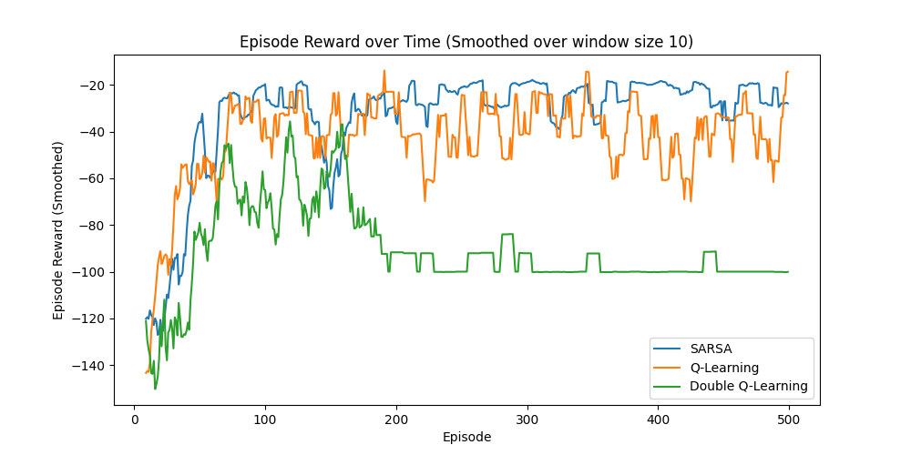
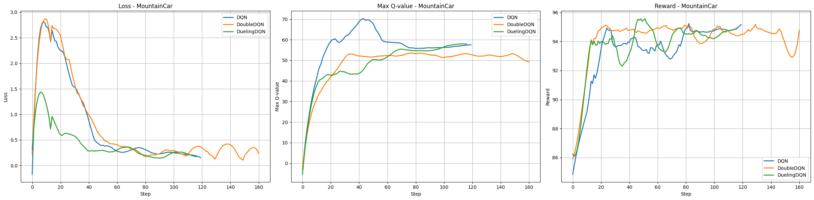
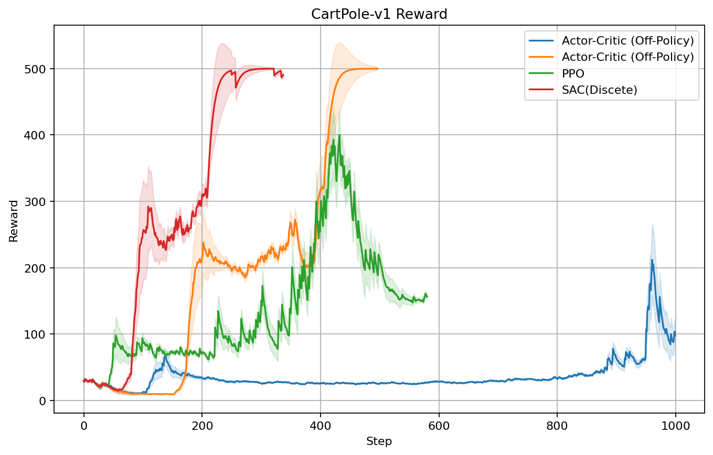
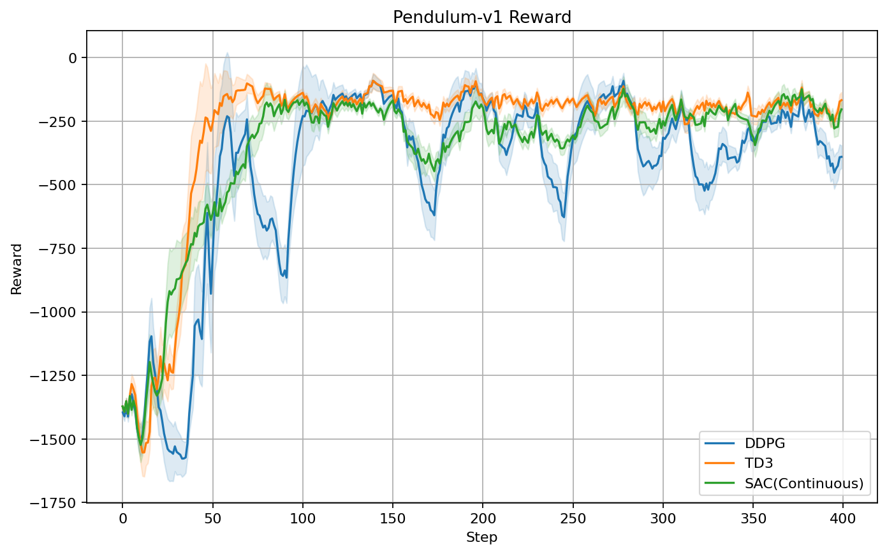

# README

## 1. Classical Reinforcement Learning

- SARSA
  $$
  Q(s,a) \leftarrow Q(s,a)+\alpha[R(s,a,s')+\gamma Q(s',a')-Q(s,a)]
  $$
  
- Q-Learning
  $$
  Q(s,a)\leftarrow Q(s,a)+\alpha[R(s,a,s')+\gamma \max_{a'}Q(s',a')-Q(s,a)]
  $$
  
- Double Q-Learning
  $$
  Q_1(s, a) \leftarrow Q_1(s, a) + \alpha \left[ R(s, a, s') + \gamma Q_2 \left(s', \arg \max_{a'} Q_1(s', a') \right) - Q_1(s, a) \right]
  $$
  

    
     

## 2. Deep Q-Leaning

- Deep Q Value Network
  $$
  loss(\phi)=\frac{1}{2N}\sum_{i=1}^N\left[Q(s_i,a_i|\phi)-(R_i+\gamma\max_{a'}Q(s_i',a'|\phi)\right]
  $$

- Double DQN
  $$
  loss(\phi|\phi^-)=\frac{1}{2N}\sum_{i=1}^N\left[Q_{e}(s_i,a_i|\phi)-(R_i+\gamma Q_{t}(s_i',a_i'|\phi^-)\right]\\
  a'_i = \arg\max_ {a'} Q _ e(s_ i',a'|\phi)
  $$

- Dueling DQN
  $$
  Q(s,a|\phi,\alpha,\beta) = V(s|\alpha,\phi)+A(s,a|\beta,\phi)-\frac{1}{|\mathcal{A}|}\sum_{\alpha'}A(s,a'|\beta,\phi)
  $$
  

    
     

## 3. Offline Reinforcement Learning

- Conservative Q-Learning

$$
\hat Q^{k+1}\leftarrow \arg \min_Q \beta\cdot \mathbb E_{s\sim \mathcal D}\left[\log\sum_a \exp(Q(s,a))-\mathbb E_{ a\sim \hat \pi(a|s)}Q(s,a)\right] + \frac{1}{2} \cdot \mathbb E_{(s,a,s')\sim \mathcal D}\left[\left(Q(s,a)-\mathcal B^\pi \hat Q^{k}(s,a)\right)^2\right]
$$

$$
\mathcal B^\pi Q(s,a) = r(s,a) +\gamma \mathbb E_{a'\sim \pi(a|s')} (Q(s',a')), \quad s'= P(s,a)
$$

    
     

## 4. Actor Critic Reinforcement Learning

- PPO: Proximal Policy Optimization
- DDPG: Deep Deterministic Policy Gradient
- TD3: Twin Delayed DDPG
- SAC: Soft Actor-Critic

    
    
     

