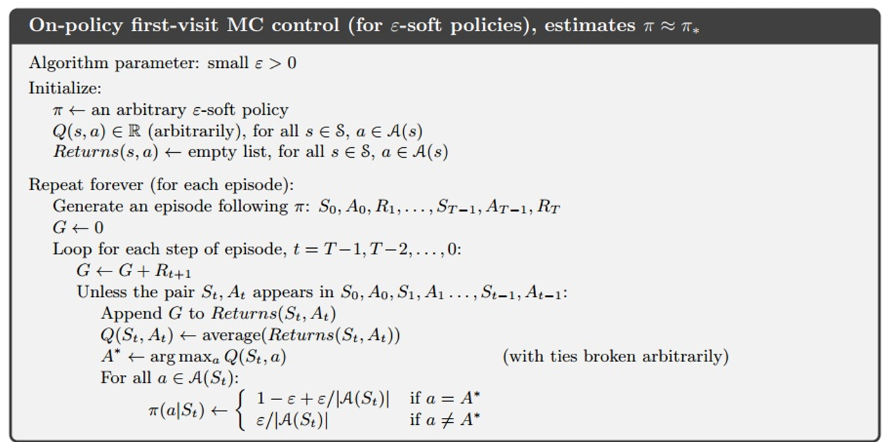
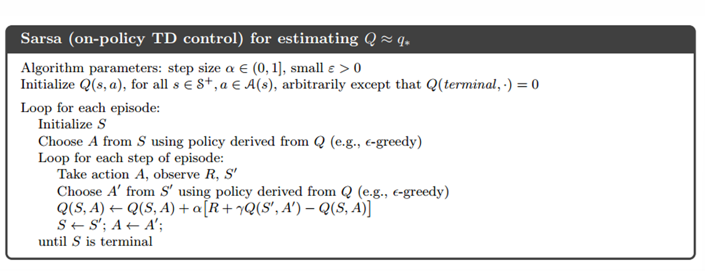
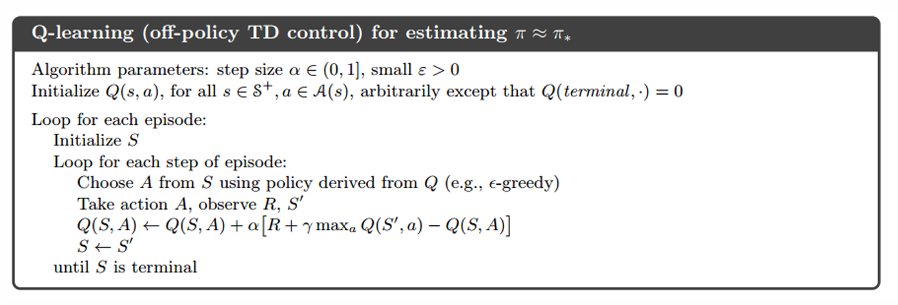
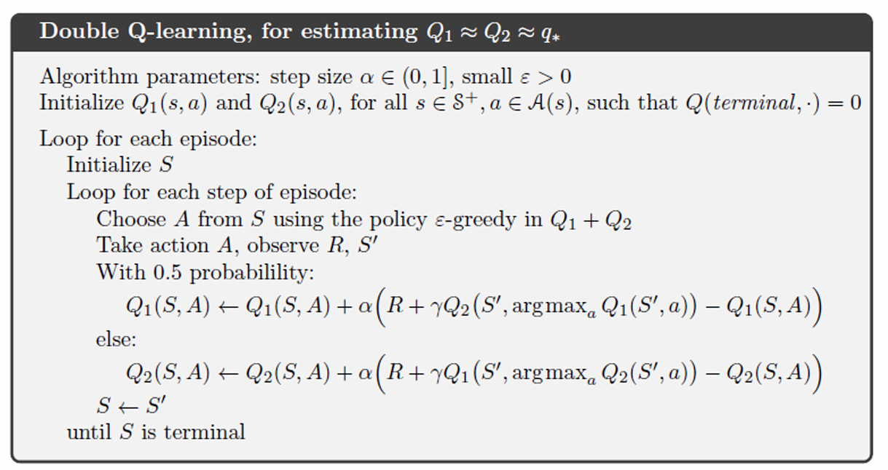
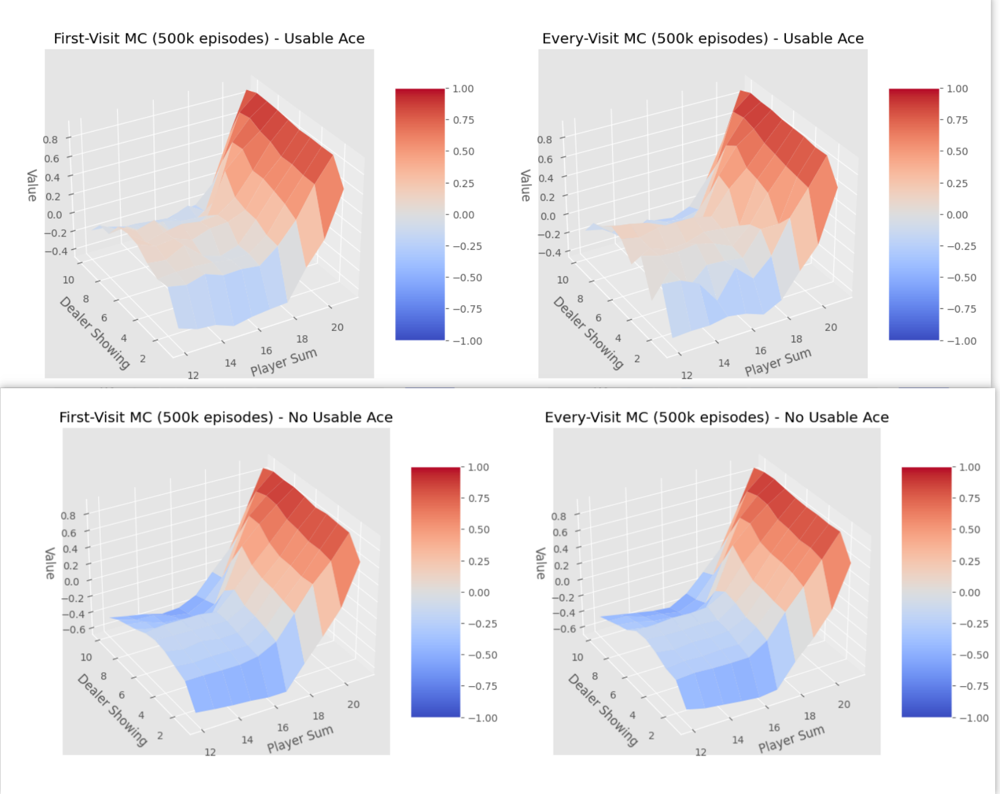
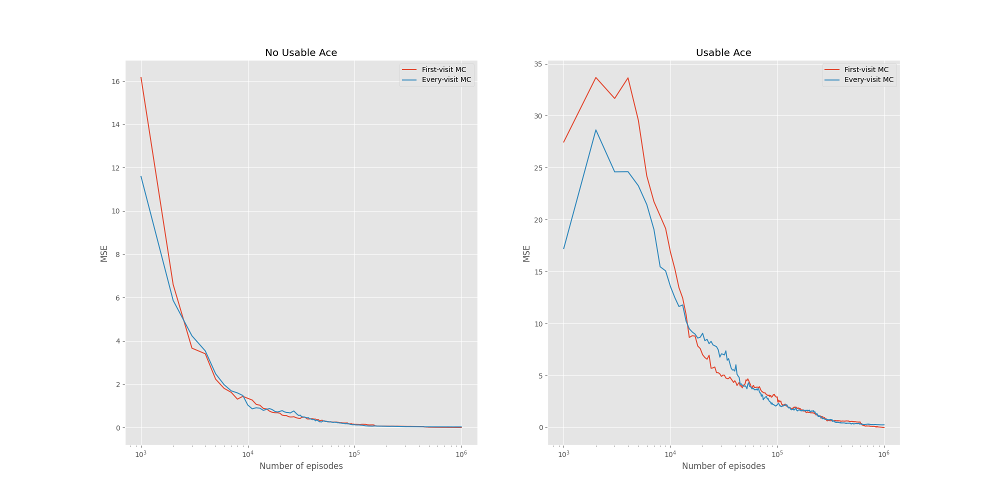
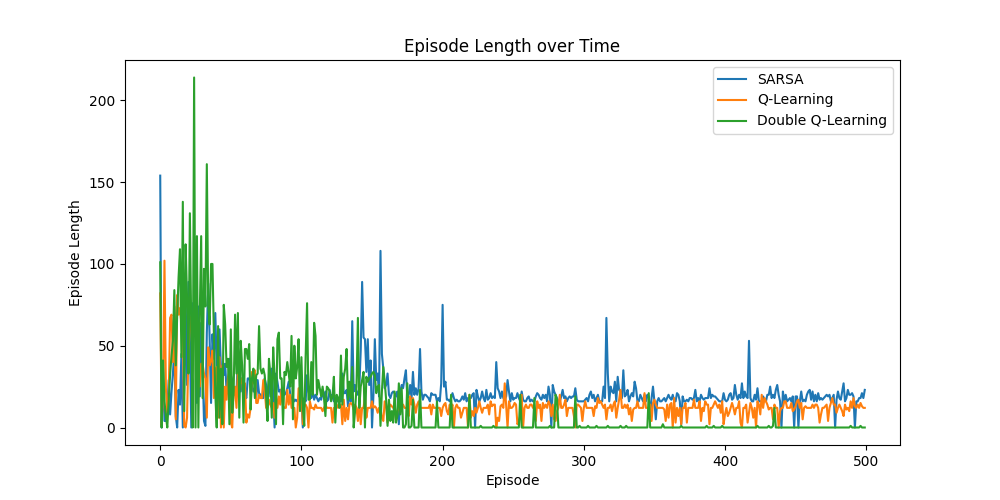
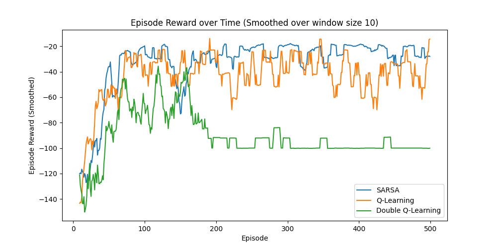
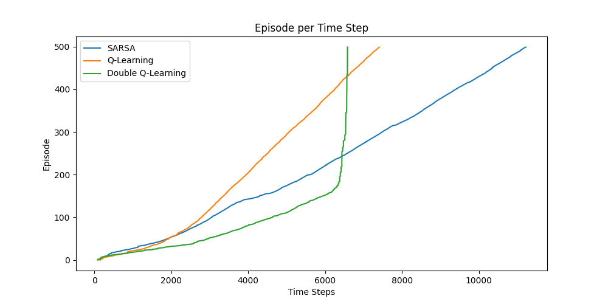

# Report1：Classical RL

## 1. Introduction

### 1.1 Basic Concept

强化学习（Reinforcement Learning, RL）是一种通过与环境交互来学习如何在不同状态下采取合适的行动，以最大化累计奖励的机器学习方法。

在强化学习中，**智能体（Agent）**在每个时刻观察到当前**状态（State）**，执行一个**行动（Action）**，并从环境中获得一个**反馈奖励（Reward）**。通过多次尝试和反馈，智能体逐步学习出一套最优**策略（Policy）**，即在不同状态下采取的最优行动选择方法。

强化学习的关键元素包括：

- **状态（State）** $s_t\in S$ ：环境在某一时刻的具体描述，提供智能体所需的所有信息。

- **观察（Observation）** $o_t\in O$：智能体对环境状态的部分或全部感知。

- **动作（Action）** $a_t\in A$：智能体在给定状态下的可能行为。

- **即时奖励（Reward）** $R_t\in R: S\times A \times S \rarr \mathbb R$ ：反馈信号，用于指示智能体采取的动作是否有利于实现目标。

- **概率轨迹 (transition probability)** $P: S\times A\rarr P(S) $，表示在给定当前状态 $s$ 和执行动作 $a$ 后，转移到其他状态 $s'$ 的概率，$P(s'|s,a)$

- **策略（Policy）**：智能体基于状态选择行动的规则或函数:

  - deterministic：$a_t = \mu(s_t)$
  - stochastic: $a_t \sim \pi(\cdot|s_t)$

- **值函数（Value Function）**：用于评估给定状态或状态-动作对的累积奖励， 是对未来收益的预期，在强调当下收益的前提下，保证未来收益足够大，因此通常定义如下：
  $$
  G(\tau) = \sum_{t=0}^{\infin} \gamma^t R_t (s_t,a_t,s_{t+1}),\quad\gamma\in(0,1)
  $$
  常用的值函数有以下两类定义：
  
  - **Value Function：** 指在当前状态 $s$ 下，执行策略 $\pi$ 获得的累积奖励：
    $$
    V^{\pi}(s)=\mathbb E_{\tau\sim\pi}[G(\tau)|s_0=s]=\mathbb E_{\tau\sim\pi,s'\sim P}\left[r(s,a)+\gamma V^{\pi}(s')\right]
    $$
  
  - **Action-Value Function:** 指在给定状态 $s$ 和当下执行的行动 $a$ 后得到的累积奖励：
    $$
    Q^{\pi}(s,a)=\mathbb E_{\tau\sim\pi}[G(\tau)|s_0=s,a_0=a]=\mathbb E_{s'\sim P}\left[r(s,a+\gamma \mathbb E_{a\sim \pi}[Q^{\pi}(s',a')])\right]
    $$

### 1.2 Model-Free vs Model-Based

强化学习的最终目的是制定合理的策略，使得未来的收益最大化。

强化学习的一个重要分支点在于是否使用环境模型。使用模型的算法称为**基于模型（Model-based）**方法，而不使用模型的算法则为**无模型（Model-free）**方法。

- **无模型的方法**：无模型方法不依赖环境模型，而是直接基于经验数据进行决策和学习。虽然牺牲了一部分采样效率，但无模型方法更易于实现和调参，因此目前得到了更广泛的发展和应用。典型的无模型方法包括MC、SARSA和Q-Learning等。

- **基于模型的方法**：通过构建环境的动态模型（包括状态转移函数和奖励函数）进行决策。智能体可以在模型的帮助下预测未来的状态和奖励，从而提前规划一系列行动。然而，这种方法的缺点在于真实环境的模型通常难以获取，模型偏差可能导致智能体在现实环境中表现不佳。

**本实验主要探讨无模型方法。**

### 1.3 Model-Free Control Problem

在无模型强化学习中，是指在给定 $(S,A,P,R)$ 下，学习最优的策略 $\pi ^*$ 以获得最优值函数 $V^*,Q^*$

- **策略（Policy）**：直接学习最优策略 $\pi_{\theta}(a|s)$ ，将状态映射到最优动作上，常用策略优化方法（Policy Optimization）来实现。

- **值函数或动作-值函数（Value Functions/Q-Functions）**：学习状态的累积奖励或状态-动作对的累积奖励，使用Bellman方程进行更新,计算每个状态-动作对的动作值，并以最大化未来累积奖励为目标来逐步逼近最优值函数 $Q^*$。以间接获得最优策略：
  $$
  a(s)=\arg \max_a Q^*(s,a)
  $$
  通常为了保证得某一个状态下所有可能的行为都有 一定的几率被选择到以此来保证足够的探索，使用 $\epsilon-greedy$ 贪婪搜索来指定策略，即：
  $$
  \pi(a|s)=\left\{
  \begin{aligned}
  &\frac{\epsilon}{|A|}+1-\epsilon\quad &a^*=\arg\max_{a\in A} Q(s,a)\\
  &\frac{\epsilon}{|A|}\quad &\text{otherwise}
  \end{aligned}
  \right.
  $$
  

在本实验中，我们主要采用**基于动作-值函数函数**的无模型强化学习方法，研究了经典的算法：

- **Monte Carlo（MC）**

- **SARSA**

- **Q-Learning**

这些算法通过不同的策略优化方式来估计最优的动作-值函数。

## 2. Algorithm

### 2.1 Monte Carlo（MC）Control

MC算法是一种基于样本的强化学习方法，通过在每个 state-action pair 访问中，使用平均累积奖励来估计值函数。MC算法通过完整的回合进行更新，即必须等到回合结束才能计算每个状态的回报，并进行值函数的更新。在每次采样时得到序列 $T=(s_0,a_0,r_1,s_1,a_1,...,s_{T-1},a_{T-1},r_{T},end)$，对 $Q(a,s)$ 更新公式如下：
$$
Q(s,a)\larr Q(s,a)+\alpha(G_t(s,a)-Q(s,a))
$$
其中 $\alpha=1/N(s，a)$ 是统计到该状态-动作的平均因子，$G_t(s,a)$ 表示在本次采样过程 $T$  中从 $(s,a)$开始到终止位置 $end$ 的累积收益。

采用了 **On-policy** 的算法：即探索行为策略和优化目标策略一致。对于利用探索结果的序列，有两种更新方式：

- **First-visit MC**：只在 **(s,a)** 第一次出现时进行更新。
- **Every-visit MC**：在 $T$ 中每次遇到 $(s,a)$ 对时都进行更新。

First-visit 算法如下：

对于 Every-visit, 则是利用了序列中出现的所有状态-动作对进行更新。

- 优点：对环境的动态模型无要求，适合于没有明确转移概率的环境。
- 缺点：更新需要等待整个回合结束，无法在回合中实时更新。

### 2.2 SARSA算法

SARSA (State-Action-Reward-State-Action)是一种基于时间差分（Temporal Difference, TD）的在线强化学习算法。它通过每个时间步的奖励进行值函数更新。SARSA是一种**on-policy**算法，即值函数更新使用的是当前策略 $\pi$ 下的行动。

更新公式如下：
$$
Q(s,a)\larr Q(s,a)+\alpha[R(s,a,s')+\gamma Q(s',a')-Q(s,a)]
$$
其中，$\alpha$ 是学习率，$\gamma$ 是折扣因子， $s'$ 和 $a'$ 分别是下一步的状态和行动。

- 优点：值函数更新过程是实时的，不需要等到回合结束；由于是on-policy，能避免部分较差的探索路径。
- 缺点：值函数更新较为保守，需要等待收敛速度可能较慢

### 2.3 Q-Learning算法

Q-Learning是一种基于TD的**off-policy**算法，通过学习一个最优的状态-行动值函数来最大化未来的累计奖励。与SARSA不同，Q-Learning不依赖于当前的策略，而是使用最大化的动作值来更新值函数。更新公式如下：
$$
Q(s,a)\larr Q(s,a)+\alpha[R(s,a,s')+\gamma \max_{a'}Q(s',a')-Q(s,a)]
$$
Q-Learning算法更新中不使用当前策略的行动选择，而是选择最优行动（off-policy），因此在策略迭代中往往收敛更快。

- 优点：由于off-policy更新，可以更快地找到最优值函数。
- 缺点：存在过估计问题，尤其在高方差的环境中。

### 2.4 Double Q-Learning算法

Double Q-Learning是一种针对Q-Learning过估计问题的改进算法。Q-Learning在更新过程中倾向于高估动作值函数的值，尤其是在高方差环境中。这是因为Q-Learning总是选择能使未来奖励最大化的动作，但在实际操作中，该动作值可能由于偶然的高奖励而被过度估计，进而影响策略的稳定性。为解决这一问题，Double Q-Learning引入了双重估计机制，以降低过估计的风险。

在Double Q-Learning中，我们维护两个独立的Q值表，分别记为$Q_1$和$Q_2$。每次更新时，随机选择一个Q表进行更新，例如在更新 $Q_1$ 时使用如下公式：
$$
Q_1(s, a) \leftarrow Q_1(s, a) + \alpha \left[ R(s, a, s') + \gamma Q_2 \left(s', \arg \max_{a'} Q_1(s', a') \right) - Q_1(s, a) \right]
$$
同样地，在更新$Q_2$时，则使用$Q_1$中的值来选择最佳动作。具体来说，Double Q-Learning在更新时分两步进行：

1. 使用第一个Q表中的值来选择动作，但不直接用于计算更新目标，而是依赖第二个Q表来评估该动作的价值。
2. 在下一个更新中，则交换两个Q表的角色，以分散对单一Q表的依赖，避免过高地估计某个动作值。

通过这种双重估计机制，Double Q-Learning有效地减少了过估计现象的发生，使得学习过程更加稳定和可靠。

- **优点**：Double Q-Learning通过双重估计机制降低了Q值的过估计问题，提升了算法在高方差环境中的表现，使得策略更稳定。
- **缺点**：维护两个Q表会增加存储和计算开销，收敛速度可能稍慢于单一Q-Learning，但在实际应用中其稳定性通常更好。

Double Q-Learning在许多强化学习任务中表现优异，尤其是在需要精确值函数估计的环境中。通过减少高估现象，它通常能够找到比单一Q-Learning更接近实际最优策略的解。

## 3. Experiment

### 3.1 实验设置

实验在`Blackjack`和`CliffWalking`环境中进行，其中：

- `Blackjack`环境用于MC算法实验，分析MC算法，比较 first-visit 和 every-visit 在不同回合数下的收敛性；
- `CliffWalking`环境用于SARSA和Q-Learning算法，比较三种TD算法在路径探索和回合奖励上的差异。

实验运行了以下几组回合数：

- MC算法：分别在 $10^3\sim 10^6$ 回合的状态值函数与1e6回合的参考状态值函数进行对比，计算MSE误差以观察收敛速度。
- SARSA和Q-Learning算法：分别在500回合内观察每回合奖励的变化情况。

### 3.2 Monte Carlo（MC）Control

在 `Blackjack` 环境中，我们对比了 **First-Visit Monte Carlo** 和 **Every-Visit Monte Carlo** 两种策略评估方法在累积奖励方面的表现。以下是它们的最终拟合Q-table

以下是不同回合数与1e6回合的参考值的MSE误差：

#### 实验结果表明：

1. **First-Visit MC**: First-Visit MC 算法在一个回合内首次访问到某状态-动作对时，计算从该状态开始的累计奖励并更新动作值函数。由于 First-Visit MC 仅在首次访问时进行更新，具有较大的采样方差，导致初期的 MSE 较高。然而，随着回合数增加，First-Visit MC 的估计逐渐逼近参考值，表现出较好的收敛性。
2. **Every-Visit MC**: Every-Visit MC 算法在一个回合内每次访问到某状态-动作对时都计算累计奖励并进行更新。由于在每个状态-动作对的多次访问下不断更新值函数，Every-Visit MC 初期的更新较为迅速，因此在前期相对于 First-Visit MC 更接近参考值。然而，由于多次访问的更新会带来一定的偏差，Every-Visit MC 在后期的收敛速度可能稍慢于 First-Visit MC，但总体仍然稳定。

### 3.3 SARSA、Q-Learning和Double Q-Learning算法结果

在 `CliffWalking` 环境中，我们对比了 **SARSA**、**Q-Learning** 和 **Double Q-Learning** 三种算法在累积奖励，以及每个episode的时间步的变化。

#### 实验结果表明：

1. **SARSA**: SARSA 算法是一种 on-policy 方法，在更新过程中始终基于当前策略。这使得 SARSA 在早期探索阶段较为保守，奖励曲线波动较小，并逐渐趋向于稳定。然而，由于其更新方式偏向保守，SARSA 需要更长的回合数才能接近最优策略。
2. **Q-Learning**: Q-Learning 使用 off-policy 更新方式，在每一步中选择能够最大化未来回报的动作值进行更新。由于这种最大化更新策略，Q-Learning 在较少回合数时就能达到较高的奖励水平，表现出更快的收敛速度。然而，这种更新方式容易引发过估计问题，特别是在高方差环境中表现出较大的波动，使得奖励曲线不够平稳。
3. **Double Q-Learning**: Double Q-Learning 通过维护两个独立的 Q 表，减少了过估计现象。在每次更新时，随机选择其中一个 Q 表进行动作选择，而使用另一个 Q 表来计算动作的未来回报。这种双重估计机制使得 Double Q-Learning 的奖励曲线在早期回合中比 Q-Learning 稳定，且波动较小。同时，它在较少回合数时即可接近最优策略，展现出较好的稳定性和收敛性。

#### 实验分析

- **收敛性**：在同样的回合数下，Q-Learning 和 Double Q-Learning 的收敛速度比 SARSA 更快，因其 off-policy 更新方式允许在更新过程中最大化未来回报。Double Q-Learning 在消除过估计现象的同时保留了快速收敛的特性，最终在大部分状态下取得了比 Q-Learning 更精确的策略。
- **稳定性**：Q-Learning 的奖励曲线波动较大，这表明过估计现象在高方差环境下较为显著。而 Double Q-Learning 在减少过估计的同时，改善了奖励曲线的稳定性，使得算法在高方差环境下的表现优于 Q-Learning。

## 4. Conclusions

在本实验中，我们对 **Monte Carlo (MC)**、**SARSA**、**Q-Learning** 和 **Double Q-Learning** 这几种经典强化学习算法进行了深入的实现与比较。通过在 `Blackjack` 和 `CliffWalking` 两个环境中的实验，我们总结了不同算法在收敛速度、稳定性和最终策略精度方面的表现。以下是主要结论：

1. **Monte Carlo（MC）Control**：
   - 在 `Blackjack` 环境中，First-Visit 和 Every-Visit MC 算法在不同回合数下的收敛性表现不同。First-Visit MC 在较大的回合数下表现更为稳定，而 Every-Visit MC 则在初期的更新速度较快，可以更早地接近参考值。总体上，First-Visit MC 更适合长期的收敛需求，而 Every-Visit MC 更适用于在少量采样下获得快速估计。
   - MC 方法由于在回合结束后更新值函数，因此在有模型环境中具有较高的样本需求。尽管在此环境下表现较好，但其应用范围相对有限，适合模拟不确定性高的环境。
2. **SARSA、Q-Learning 和 Double Q-Learning**：
   - 在 `CliffWalking` 环境中，SARSA 作为 on-policy 算法，在策略更新上较为保守，能在前期探索阶段保持较稳定的回合奖励，但需要较长的回合数来达到最优策略。相比之下，Q-Learning 和 Double Q-Learning 利用 off-policy 更新，加速了策略收敛。
   - **Q-Learning** 在较少回合数下能迅速获得较高的奖励，但因过估计现象，奖励曲线的波动较大，尤其是在高方差环境中，表现出不稳定性。**Double Q-Learning** 则通过双重估计机制有效减少了过估计现象，使得收敛更为平稳，在不同回合数下都表现出更好的稳定性。
3. **收敛性与稳定性对比**：
   - 在收敛性方面，off-policy 算法（如 Q-Learning 和 Double Q-Learning）在更新过程中能够利用历史数据，表现出更快的收敛速度，而 SARSA 和 First-Visit MC 则更加保守，适合需要稳定更新的场景。
   - 在稳定性方面，Double Q-Learning 在减小过估计的同时，保留了快速收敛的优点，能在较高方差环境中提供更平稳的回合奖励表现，是一种高效的强化学习方法。
