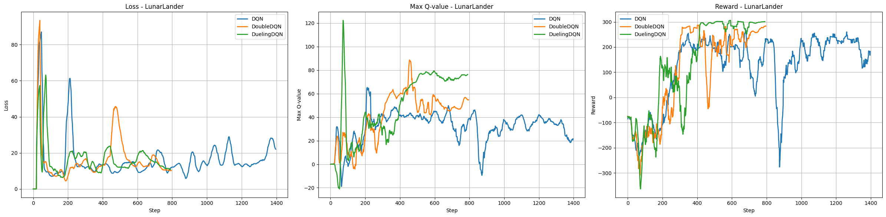

# Lab2: Deep RL

> Deep Q-Network

## 1. Overview

DQN（**deep Q-network**）是指基于深度学习的 **Q-learning** 算法，主要结合了价值函数近似（**value function  approximation**）与神经网络技术(**Neural Networks)**，并采用目标网络和经历回放等方法进行网络的训练。

传统的 Q-learning 算法会使用表格的形式存储状态价值函数 $V(s)$ 或动作价值函数  $Q(s,a)$。但现实任务所面临的状态空间往往是连续的，就不能再使用表格的方式进行存储。因此引入了神经网络 (**Q-network**)来近似的拟合上述两种函数，这个方法被称之为价值函数近似(**value function approximation**)。
$$
Q_{\phi}(s,a)\approx Q_{\pi}(s,a)
$$
其中 $s,a$ 分别是状态 s 和动作 a 的向量表示， 上式左侧的函数表示参数为 $\phi$ 的函数，比如神经网络中的权重参数，输出为实数。


本实验主要针对 `Gymnasium` 库提供的实验环境：

- `Mountain Car Continuous`，

- `Pendulum`

- `LunarLander` 

它们特点是**状态空间 (State Space) 都是连续值**，对于连续的**动作空间 (Action Space)**，进行了动作空间离散化处理，因为通常 DQN（以及 Q-learning）只能处理动作离散的情况，在函数的更新过程中有 $\max_a$ 这一操作。

本实验主要对比的算法包含：

- **Deep Q-Network**
- **Double DQN**
- **Dueling DQN**

## 2. Algorithm

### 2.1 Deep Q-Network

假设神经网络用来拟合函数的参数是  $\phi$ ，即每一个状态 $s$ 下所有可能动作 $a$ 的值表示为 $Q(s,a|\phi)$ 。我们将用于拟合函数函数的神经网络称为 **Q-Network**.


#### Classical Q-Learning

在传统的 **Q-Learning** 算法中，利用**时序差分**（temporal difference，TD）的方式更新 Q-Table ：

$$
Q(s,a)\leftarrow Q(s,a)+\alpha \left[R(s,a,s')+\gamma \max_{a'} Q(s',a')-Q(s,a)\right]
$$

#### Deep Q-Learning

那么自然地，可以利用神经网络来学习更新动作价值函数  $Q(s,a)$ ，具体来说，我们定义损失函数：

$$
loss(\phi)=\frac{1}{2N}\sum_{i=1}^N\left[Q(s_i,a_i|\phi)-(R_i+\gamma\max_{a'}Q(s_i',a'|\phi)\right]
$$

其中：$N$ 是 Batch Size 大小，通过有**经验放回 (experience replay) ** 采样，提高样本利用效率；$\gamma$ 是对未来值的折扣因子。

这样可以将 Q-learning 扩展到神经网络形式——**深度 Q 网络**（deep Q network，DQN）算法。

```python
class Qnet(nn.Module):
    def __init__(self, num_inputs=4, hidden_dim=128, num_actions=2):
        # Input dimension is num_inputs, output dimension is num_actions
        super(Qnet, self).__init__()
        self.fc1 = nn.Linear(num_inputs, hidden_dim)
        self.fc2 = nn.Linear(hidden_dim, hidden_dim)
        self.fc3 = nn.Linear(hidden_dim, num_actions)

    def forward(self, x):
        x = F.relu(self.fc1(x))
        x = F.relu(self.fc2(x))
        x = self.fc3(x)
        return x
```

#### Target Network

由于 DQN 是**离线策略算法**，因此我们在收集数据的时候可以使用一个 $\epsilon-greed$ 策略来平衡探索与利用，将收集到的数据存储起来，在后续的训练中使用。

DQN 算法最终更新的目标是让逼近，由于 TD 误差目标本身就包含神经网络的输出，因此在更新网络参数的同时目标也在不断地改变，这非常容易造成神经网络训练的不稳定性。

为了解决这一问题，DQN 使用了**目标网络**（target network）的思想：如果训练过程中 Q 网络的不断更新会导致目标不断发生改变，那么就暂时先将 TD 目标中的 Q 网络固定住，以固定的频率更新至最新的参数 $\phi$，避免训练的不稳定。

因此，与Q-Learning算法不同的是：需要利用两套 Q 网络，此时损失函数定义为：

$$
loss(\phi|\phi^-)=\frac{1}{2N}\sum_{i=1}^N\left[Q_{e}(s_i,a_i|\phi)-(R_i+\gamma\max_{a'}Q_{t}(s_i',a'|\phi^-)\right]
$$

唯一的不同在于，计算未来的Q值时，采用的另一个网络的参数 $\phi^-$ ，它是滞后的未更新的参数。

- Eval-Net：用于实际训练的网络，计算 $Q_e(s_i,a_i|\phi)$ ，在每次进行梯度下降更新时，更新 $\phi$ 的值。
- Target-Net: 用于计算未来的 $Q(s',a')$ 值，这样可以让更新目标更稳定， $\phi^-$ 以固定的频率 $C$ 更新。

#### Algorithm


### 2.2 Double DQN

#### Overestimation

虽然 DQN 首先使用神经网络来训练 Q-Function，但也同样带来了 Q-Learning固有的问题：对 Q-Function 的过高估计（**overestimation**）。

具体来说，overestimation 问题是 agent  在任何给定状态下总是选择非最优动作，只是因为它具有最大 $Q$ 值。然而， Agent  一开始对环境一无所知，它需要首先估计 $Q(s',a')$，以选择动作 $a'$ 最大化 $Q$ 值。但这样的 $Q$ 值有很多噪声，我们永远无法确定具有最大期望 Q 值的动作 $a'$ 是否真的是最好的。

#### Double Q-Learning

为了解决这一问题，Double DQN 算法提出利用两个独立训练的神经网络估算 $\max_{a'} Q(s',a')$，具体来说，我们的损失函数定义为：

$$
loss(\phi|\phi^-)=\frac{1}{2N}\sum_{i=1}^N\left[Q_{e}(s_i,a_i|\phi)-(R_i+\gamma Q_{t}(s_i',a_i'|\phi^-)\right]\\
a'_i = \arg\max_{a'}Q_e(s_i',a'|\phi)
$$

即利用一套神经网络 $Q_e$ 的输出选取价值最大的动作 $a’$ ，但在使用该动作 $a'$ 的价值时，用另一套神经网络计 $Q_t$ 算该动作 $a'$ 的价值。这样，即使其中一套神经网络的某个动作存在比较严重的过高估计问题，由于另一套神经网络的存在，这个动作最终使用的 $Q$ 值不会存在很大的过高估计问题。

#### Algorithm


```python
q_eval = self.eval_net(states).gather(1, actions)
if self.method == 'doubledqn':
    # Select the best action based on eval_net
    actions_eval = self.eval_net(next_states).argmax(1, keepdim=True)
    # Evaluate the selected actions using target_net
    q_next = self.target_net(next_states).gather(1, actions_eval)
else:
    q_next = self.target_net(next_states).max(1, keepdim=True)[0]

q_target = rewards + self.gamma * q_next * (1 - dones)
# update evaluate net
self.optimizer.zero_grad()
loss = self.loss_func(q_eval, q_target)
loss.backward()
self.optimizer.step()
# updata target net
if self.learn_step_counter % self.q_network_iteration == 0:
   self.target_net.load_state_dict(self.eval_net.state_dict())
```

### 2.3 Dueling DQN

Dueling DQN 是 DQN 另一种的改进算法，它在传统 DQN 的基础上只进行了微小的改动，但却能大幅提升 DQN 的表现。

####  Advantage function

在强化学习中，我们将状态动作价值函数 $Q$ 减去状态价值函数 $V$ 的结果定义为优势函数 $A$ ，即

$$
A(s,a)=Q(s,a)-V(s)
$$

在同一个状态下，所有动作的优势值之和为 0，因为所有动作的动作价值的期望就是这个状态的状态价值。据此，在 Dueling DQN 中，Q 网络被建模为：

$$
Q(s,a|\phi,\alpha,\beta) = V(s|\alpha,\phi)+A(s,a|\beta,\phi)
$$


将状态价值函数和优势函数分别建模的好处在于：某些情境下智能体只会关注状态的价值，而并不关心不同动作导致的差异，此时将二者分开建模能够使智能体更好地处理与动作关联较小的状态。

#### Stability

对于原有的 $Q=V+A$ 的建模存在不唯一性，即：同样的 $Q$ 值，如果将 $V$ 值加上任意大小的常数 $C$ ，再将所有 $A$ 值减去 $C$ ，则得到的 $Q$ 值依然不变，这就导致了训练的不稳定性。

为了解决这一问题，Dueling DQN 强制最优动作的优势函数的实际输出为 0，即：

$$
Q(s,a|\phi,\alpha,\beta) = V(s|\alpha,\phi)+A(s,a|\beta,\phi)-\max_{\alpha'}A(s,a'|\beta,\phi)
$$

在实现过程中，我们还可以用平均代替最大化操作：

$$
Q(s,a|\phi,\alpha,\beta) = V(s|\alpha,\phi)+A(s,a|\beta,\phi)-\frac{1}{|\mathcal{A}|}\sum_{\alpha'}A(s,a'|\beta,\phi)
$$

虽然它不再满足贝尔曼最优方程，但实际应用时更加稳定。

```python
class VAnet(torch.nn.Module):
    def __init__(self, num_inputs, hidden_dim, num_actions):
        super(VAnet, self).__init__()
        self.fc1 = torch.nn.Linear(num_inputs, hidden_dim)
        self.fc2 = torch.nn.Linear(hidden_dim, hidden_dim)
        self.fc_A = torch.nn.Linear(hidden_dim, num_actions)
        self.fc_V = torch.nn.Linear(hidden_dim, 1)

    def forward(self, x):
        x = F.relu(self.fc1(x))
        x = F.relu(self.fc2(x))
        A = self.fc_A(x)
        V = self.fc_V(x)
        Q = V + A - A.mean(-1).view(-1, 1)
        return Q
```

## 3. Results

### 3.1 Pendulum

测试 `Pendulum-V1` 环境，这个环境的特点在于，它的理论Q值都应该小于0，即：
$$
r = -(\theta^2 + 0.1 * \theta dt^2 + 0.001 * \text{torque}^ 2)
$$
这将容易区分是否存在高估的现象，如下图：


可以看到，对于 **DQN (蓝) ** 方法，最大 Q 值出现了大于0的情况，这说明了 **DQN** 存在高估的现象，在对比 **Double DQN (橙)** 后可以看到，其没有出现高估的问题，最后由 **Loss** 和 **Reward** 的收敛性表面其都收敛到最优值。


### 3.2 Mountain Car Continuous

对于 `Mountain Car` 环境，比较明显的特征是，我们选择了 25 个动作空间对连续空间进行离散化。


由图 **Loss** 中可以看到，随着动作空间的增大，**Dueling DQN (绿) ** 相比于 **DQN (蓝) ** 的优势更为明显，相比于传统的 DQN，Dueling DQN 在多个动作选择下的学习更加稳定，得到的回报最大值也更大。


### 3.3 Lunar Lander

对于 `Lunar Lander`，其存在的状态和奖励更多，也更加难以拟合，结果如下



从结果可以看到，

- **Dueling DQN (绿)** 能够稳定收敛，且收敛到最大值；

-  **DQN (蓝)** 无法收敛，且很不稳定；
-  **Double DQN (橙)**  最终也能收敛，但收敛结果没有 **Dueling DQN** 优异。


### 4. 总结

在本实验中，我们深入探讨了深度强化学习中的三种关键算法：**Deep Q-Network (DQN)**、**Double DQN** 和 **Dueling DQN**，并通过在 `Gymnasium` 提供的多个连续状态空间环境（Mountain Car Continuous、Pendulum 和 Lunar Lander）上的实验，系统性地比较了它们的性能表现。

**主要发现如下：**

1. **DQN 的局限性**：
   - 尽管 DQN 通过引入神经网络有效地扩展了传统 Q-learning 的应用范围，但在实际应用中仍面临 Q 值过高估计的问题，尤其在 Pendulum 环境中表现尤为明显。这种过高估计不仅影响策略的稳定性，还可能导致智能体选择次优动作。
2. **Double DQN 的改进**：
   - Double DQN 通过分离动作选择与动作价值评估，成功缓解了 DQN 的过高估计问题。在 Pendulum 和 Lunar Lander 环境中，Double DQN 显示出更为稳定和合理的 Q 值估计，提升了策略的可靠性。然而，在某些复杂环境中，如 Lunar Lander，其性能提升相对于 Dueling DQN 略显不足。
3. **Dueling DQN 的优势**：
   - Dueling DQN 通过将 Q 函数分解为状态价值函数和优势函数，不仅提升了学习效率，还在多个实验环境中显著提高了最终回报。尤其在动作空间较大或环境状态复杂的任务（如 Mountain Car Continuous 和 Lunar Lander）中，Dueling DQN 展现出更强的适应性和更高的性能稳定性。

**实验结果表明**，结合 **经验回放** 和 **目标网络** 的策略对于深度 Q 网络的稳定训练至关重要。而 **Double DQN** 和 **Dueling DQN** 作为 DQN 的重要改进版本，分别从减少 Q 值过高估计和优化 Q 函数结构两个方面，显著提升了深度强化学习算法的性能。

**总体而言**，Dueling DQN 在本次实验中表现最为优异，尤其在处理复杂和高维度的任务时，显示出了其卓越的学习能力和稳定性。未来的研究可以进一步结合这两种改进方法，探索更为高效和鲁棒的深度强化学习算法，以应对更为复杂和多样化的实际应用场景。
