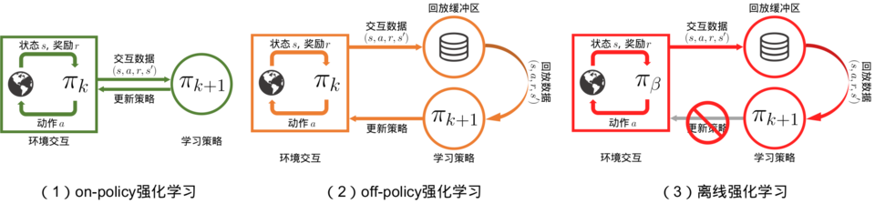
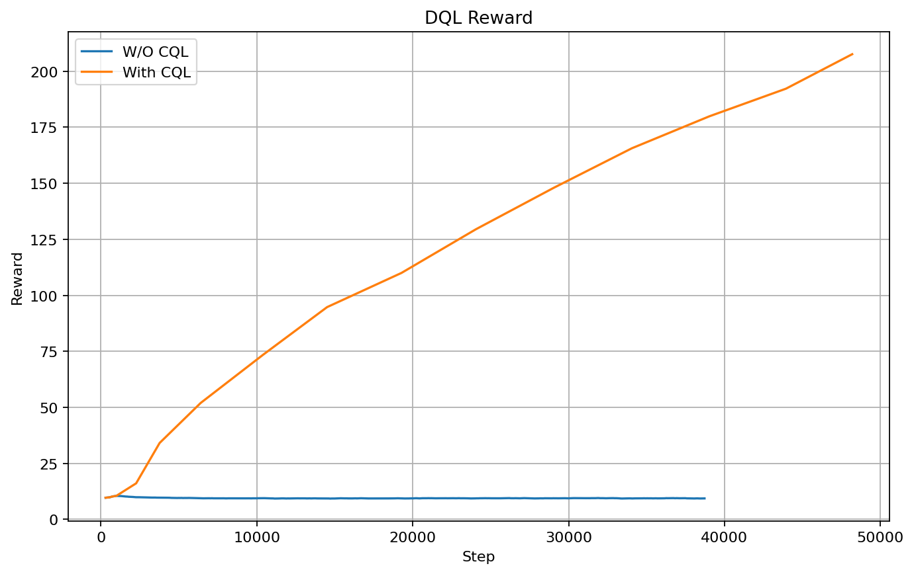
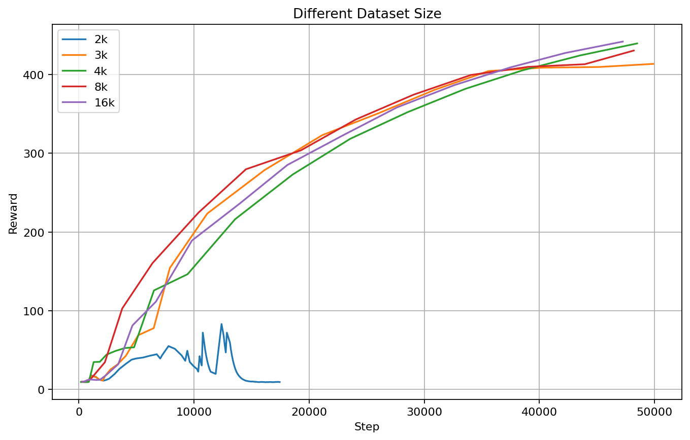
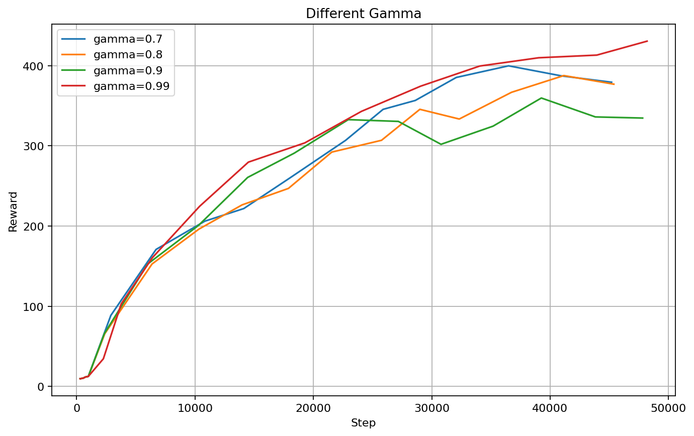
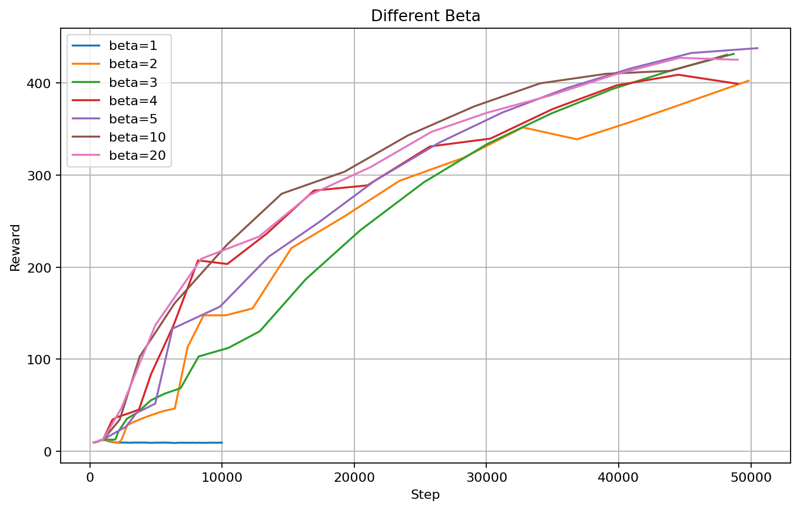

# Lab3: Offline RL

> Conservative Q-Learning

## 1. Introduction

**离线强化学习(Offline Reinforcement Learning)** 目标是：在智能体不和环境交互的情况下，仅从已经收集好的确定的数据集 $\{(s,a,r,s')\}$  中，通过强化学习算法得到比较好的策略。离线强化学习在探索代价高、风险大或不可行的领域中具有重要应用，例如医疗、自动驾驶和机器人技术。

> 虽然与在线强化学习(on-policy, off-policy)不同，但某种程度上，可以从形式上把 Offline RL 看做 Online Off-policy RL 的一个切片，要求用某一时刻 replay buffer 中的轨迹数据直接学出好策略，因此理论上 DQN、DDPG 等的 Online Off-policy RL 方法都是可以直接拿过来用的。



但是在实际训练时，由于使用的是**"有限"、"静态"**数据集，不可避免的造成 **Distributional Shift** 问题。这导致对于没有在数据集中出现过的数据 (Out-of-distribution, OOD)，由于学习的泛化能力有限，在估计 $Q(s,a)$ 时，策略容易造成过高估计(**over-estimation**)。

这样所产生的误差常被称作**外推误差 (extrapolation error) **，即：由于产生数据集 $(s,a)$ 的策略和当前策略 target policy 所诱导的真实 $(s,a)$ 分布之间的不匹配而引入的价值估计误差。

> - Behavior Policy： 用来与环境互动产生数据的策略 ， 即在训练过程中做决策 。例如智能体不断的与环境交互，更新Q表格中的Q值。
>
> - Target Policy： 在产生的数据中不断学习、优化，即学习训练完毕后拿去应用的策略。 也就是智能体根据Q表格中的数据进行学习，判断在每个状态下发起什么动作。

为了解决 **extrapolation error**问题，在常见的 RL-Based 方法中通常有两种做法：

- **policy constrain**：直接对 target policy 进行约束，尽量使当前训练的策略只访问与数据集中相似的(s,a)数据，避免其与 behavior policy 偏离过多。
- **value regularization**: 约束价值函数估计，进行悲观假设，对于偏离数据集的点上的 $Q(s,a)$ 保持在较低的值，消除部分外推误差的影响。

本实验主要讨论 **value regularization** 的方法。

## 2. Conservative Q-Learning

**Conservative Q-Learning, CQL**  是在目标函数中引入惩罚项，对分布外（OOD）动作的Q值进行约束。通过抑制对稀有或分布外动作的过度乐观估计，使策略更保守，在无法继续采集新数据的前提下，保证学到策略不会依赖数据外动作获取虚高回报。

### 2.1 Q-Learning

在 Q-Learning 算法中，$Q$ 的更新方程写成：
$$
\hat Q^{k+1}\leftarrow \arg \min_Q \mathbb E_{(s,a,s')\sim \mathcal D}\left[\left(Q(s,a)-\mathcal B^\pi \hat Q^{k}(s,a)\right)^2\right]
$$
其中，$\mathcal D$ 是训练数据集，$\mathcal B^\pi$ 是基于策略 $\pi$ 的 Bellman operator：
$$
\mathcal B^\pi Q(s,a) = r(s,a) +\gamma \mathbb E_{a'\sim \pi(a|s')} (Q(s',a')), \quad s'= P(s,a)
$$
这里假定了 $s'$ 是由 $P(s,a)$ 唯一确定的，$\gamma$ 是折扣因子

### 2.2 Conservation Regularization

对于给定数据集 $\mathcal D $ 的情况下，一般 $(s,a,s')$ 都可以通过 $\mathcal D $ 采样获取，但 $a'$ 是基于策略 $\pi$ 生成的，会导致新的数据项 $(s,a,s',a')$ 可能不在 $\mathcal D$ 中，导致更新 Q 值出现过高的估计。所以引入正则项限制 Q 值：
$$
\begin{aligned}
\hat Q^{k+1}\leftarrow \arg \min_Q\left\{ \beta\cdot\left[\mathbb E_{s\sim\mathcal D, a\sim \mu(a|s)}Q(s,a)-\mathbb E_{s\sim \mathcal D, a\sim \hat \pi(a|s)}Q(s,a)\right]\\
+ \frac{1}{2} \cdot \mathbb E_{(s,a,s')\sim \mathcal D}\left[\left(Q(s,a)-\mathcal B^\pi \hat Q^{k}(s,a)\right)^2\right]\right\}
\end{aligned}
$$
其中，

- $\beta$ 为正则项系数，在约束程度和价值估计准确程度的 trade-off 做平衡；
- $\mu$ 为某个策略分布，用于采样各个状态 $s$ 下的动作 $a$ 分布
- $\hat \pi$ 为 Behavior Policy，以确保符合数据集的 $(s,a)$ Q的估计下限，在offline-RL中：$\{s\sim \mathcal D, a\sim \hat \pi(a|s)\}=\{(s,a)\sim \mathcal D\}$；

### 2.3 Choose $\mu$

在上式中，当采取 $\mu=\pi$ 的方式来采样，可以确保 $\mathbb E_{\pi(a|s)}[Q(s,a)]\le V^\pi(s)$，但是在训练迭代时交替计算代价太高，我们考虑到 $\pi$ 的合理近似定义：
$$
\pi \approx \arg \max_{\mu} \mathbb E_{s\sim D, a\sim\mu(a|s)}[Q(s,a)]
$$
因此我们得到：
$$
\begin{aligned}
\hat Q^{k+1}\leftarrow \arg \min_Q\left\{ \max_{\mu}\beta\cdot\left[\mathbb E_{s\sim\mathcal D, a\sim \mu(a|s)}Q(s,a)-\mathbb E_{s\sim \mathcal D, a\sim \hat \pi(a|s)}Q(s,a)\right]\\
+ \frac{1}{2} \cdot \mathbb E_{(s,a,s')\sim \mathcal D}\left[\left(Q(s,a)-\mathcal B^\pi \hat Q^{k}(s,a)\right)^2\right]\right\}
\end{aligned}
$$
对于函数 $\mu$ 来说，这一个变分问题 (variational problem) 。为了避免 $\mu$ 方差过大，我们采用均匀分布 $\rho(a|s)=\mathcal U(a)$ 作为 $\mu$ 的 先验假设，引入 $KL$ 散度约束，此时变分问题为：
$$
\max_\mu J(\mu) = \max_\mu \mathbb E_{s\sim D, a\sim \mu(a|s)}[Q(s,a)]-D_{KL}[\mu(a|s),\mathcal U(a)]\quad s.t \int \mu da=1,\mu(a|s)\ge0
$$
上式得到的最大值为：
$$
\begin{aligned}
\max_\mu J(\mu) &= \mathbb E_{s\sim \mathcal D}\left[\log\int_\mathcal A \exp(Q(s,a)) d\mathcal A\right]\\
&=\mathbb E_{s\sim \mathcal D}\left[\log\sum_a \exp(Q(s,a))\right]
\end{aligned}
$$

### 2.4  CQL

综合以上，我们得到最终的迭代方法：
$$
\begin{aligned}
\hat Q^{k+1}\leftarrow \arg \min_Q \left\{\beta\cdot \mathbb E_{s\sim \mathcal D}\left[\log\sum_a \exp(Q(s,a))-\mathbb E_{ a\sim \hat \pi(a|s)}Q(s,a)\right]\\
+ \frac{1}{2} \cdot \mathbb E_{(s,a,s')\sim \mathcal D}\left[\left(Q(s,a)-\mathcal B^\pi \hat Q^{k}(s,a)\right)^2\right]\right\}
\end{aligned}
$$
上式针对的是离散动作空间 $\mathcal A$ 下的表达式，不含有 $\mu$ .

### 2.5 Code

代码基于 `Double Deep Q-Learning` 为 Baseline 基准进行对比：

```python
def DQL(data):
    """
    Double Deep Q Learning with Conservation
    """
    # Double Q Learning Loss
    states, actions, rewards, next_states, dones = data
    q_eval = q1(states).gather(dim=1, index=actions)  #[batch_size, 1]
    with torch.no_grad():
        actions_eval = q1(next_states).argmax(dim=1).unsqueez(-1)  # [batch_size, 1]
        q_next = q1_target(next_states).gather(dim=1,index=actions_eval)  # [batch_size, 1]
        q_target = rewards + GAMMA * q_next * (1 - dones)
    loss = nn.MSELoss()(q_eval, q_target)
    
    #--------------------------------------------------------------------
    #! CQL Loss
    if BETA > 0:
        action_unif = torch.arange(0, act_dim)\
        				.unsqueeze(0).repeat(BATCH_SIZE, 1).to(device) # [batch_size, act_dim]
        q1_unif = q1(states).gather(dim=1,index=action_unif)
        cql1_loss = (torch.logsumexp(q1_unif, dim=1)).mean()- q_eval.mean()
        loss = loss + BETA * cql1_loss
    #--------------------------------------------------------------------
        
    # Gradient Decent
    q1_optimizer.zero_grad()
    loss.backward()
    q1_optimizer.step()
    if global_step % Q_NETWORK_ITERATION == 0:
    	q1_target.load_state_dict(q1.state_dict())
```

可以在代码中看到，采取了简单的 `torch.arange` ，实现对离散动作空间的采样；基于 `torch.logsumexp` 实现对 `CQL` 的计算。

## 3. Experiment

实验主要在 `Gymnasium` 库提供的实验环境`CartPole-v1` 进行，由 `SAC` 算法提供专家数据（静态离线数据） `dataset_episode_350.npz` ，实验从三个方面进行对比：

- 对比 CQL 和 Q-Learning 算法实验结果；
- 对比不同数据集大小 $|\mathcal D|$ 下对训练的影响；
- 对比折扣因子 $\gamma$ ，平衡因子 $\beta$对训练的影响。

如果没有特殊说明，实验在以下超参数下进行：

- 折扣因子: GAMMA = 0.99
- 平衡因子：BETA = 5
- 批次大小: BATCH_SIZE = 64 
- Q 网络学习率: LR_Q = 3e-4
- Q 网络更新次数: Q_NETWORK_ITERATION =50
- 数据集大小：DATASET_SIZE = 8192

### 3.1 Q-Learning vs CQL

对比 Double Deep Q-Learning 和 添加了 Conservation 约束的情况下，实验得到收益和训练步数之间的关系如下：



可以看到如果没有 $CQL$ 进行约束，由于 extrapolation error 的问题会导致DQL无法收敛。

### 3.2 Dataset Size $|\mathcal D|$

在实验中，我们对数据集进行不同程度的采样，用于控制训练数据集大小：

```python
class ReplayBuffer:
    def __init__(self, capacity=MEMORY_SIZE):
        self.capacity = capacity
        self.buffer = deque(maxlen=capacity)

    def push(self, state, action, reward, next_state, done):
        self.buffer.append((state, action, reward, next_state, done))

    def read(self, filename, load_size=None):
        """
        从文件中读取数据到回放池中。
        """
        data = np.load(filename)
        states = data["states"]
        actions = data["actions"]
        rewards = data["rewards"]
        next_states = data["next_states"]
        dones = data["dones"]
        if load_size is not None and load_size < len(states):
            shuffle_idx = np.random.permutation(len(states))
            shuffle_idx = shuffle_idx[:load_size]
            states = states[shuffle_idx]
            actions = actions[shuffle_idx]
            rewards = rewards[shuffle_idx]
            next_states = next_states[shuffle_idx]
            dones = dones[shuffle_idx]
        print(f"Load data from {filename}, size: {len(states)}")
        for i in range(len(states)):
            self.push(states[i], actions[i], rewards[i], next_states[i], dones[i])
```

结果如下：



可以看到，更大的数据集有利于使得 Behavior Policy 更加接近真实情况，有助于收敛更快，以及最终收敛到更好的结果。当数据集很小时，即使在 CQL 的约束下，仍然无法收敛，说明了数据集大小的重要性。

### 3.3 Hyper Parameters

#### 折扣因子 $\gamma$ 

$\gamma$ 主要用于度量对未来 reward 的权重:
$$
Q(s,a) \leftarrow Q(s,a)+\alpha[R(s,a,s')+\gamma Q(s',a')-Q(s,a)]
$$
对比结果如下：



可以看到，在一定步数范围内，更大的 $\gamma$，Q值会更加注重未来的奖励，有利于更快的收敛。

#### 平衡因子 $\beta$

$\beta$ 为正则项系数，在约束程度和价值估计准确程度的 trade-off 做平衡，对比如下：



从图中可以看到：

- 过小的 $\beta$ 会导致结果无法收敛
- 过大的 $\beta$ 最终收敛的Q值结果偏低，这可能与过于保守的策略有关
- 适当的 $\beta$ 可以提高收敛速度和最终结果的准确度。

## 4. Summary

本实验针对**离线强化学习（Offline RL）**中常见的问题——**外推误差（Extrapolation Error）**，探讨了如何通过引入**保守Q学习（Conservative Q-Learning, CQL）**来解决这一问题。

通过在目标函数中增加惩罚项，CQL能够约束模型对稀有或不常见的行为进行过度乐观的估计，从而在无法收集更多数据的情况下，保证学习到的策略依赖于数据集中的真实分布，并避免策略过度依赖于数据集外的动作获取虚高回报。

实验中，我们基于`Double Deep Q-Learning`算法作为基准，添加CQL约束后进行对比实验，得出了以下主要结论：

1. **CQL对比Q-Learning**：实验结果显示，添加CQL约束后，能够有效抑制外推误差，使得模型在离线数据集上能够较为稳定地收敛，避免了没有CQL时DQL由于外推误差导致的Q值过高和不收敛问题。
2. **数据集大小的影响**：随着数据集大小的增加，模型能够更好地逼近真实的行为策略，收敛速度更快，最终的Q值结果也更加准确。对于小数据集，CQL虽然能够减少外推误差，但由于数据量不足，仍然无法有效收敛。
3. **超参数的选择**：
   - **折扣因子（$\gamma$）**：较大的折扣因子使得模型更加注重未来的奖励，有助于加速收敛。
   - **平衡因子（$\beta$）**：平衡因子的选择对于结果收敛至关重要。过小的$\beta$无法有效控制过度乐观的Q值估计，而过大的$\beta$会导致策略过于保守，Q值过低。因此，合适的$\beta$能够加速收敛并提高结果的准确性。

通过本次实验，我们进一步验证了CQL在离线强化学习中的有效性，特别是在解决**外推误差**和**Q值过估计**方面的优势。同时，实验还揭示了数据集大小和超参数设置对离线强化学习效果的显著影响，为实际应用中的模型优化提供了有益的指导。
