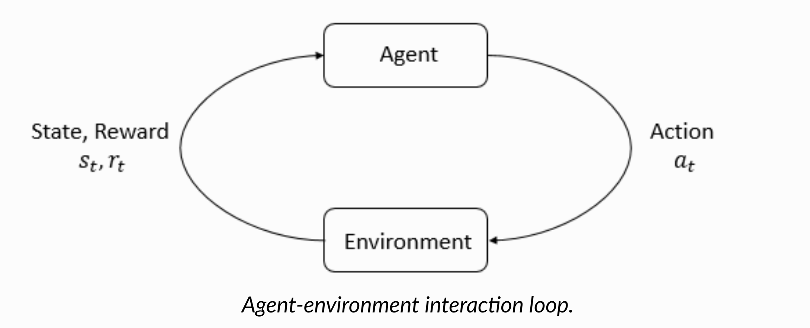
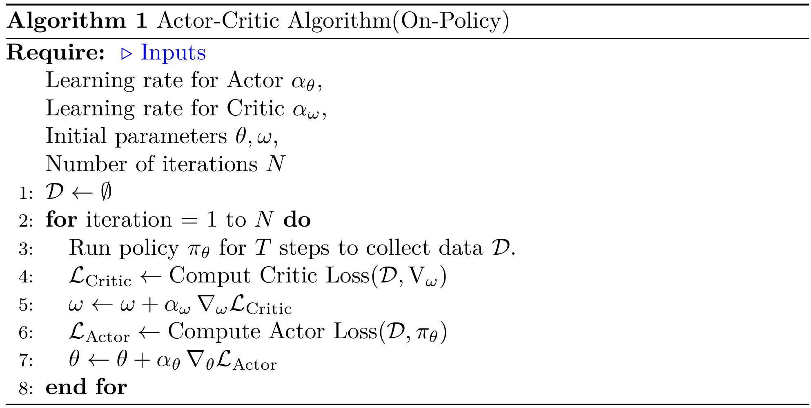
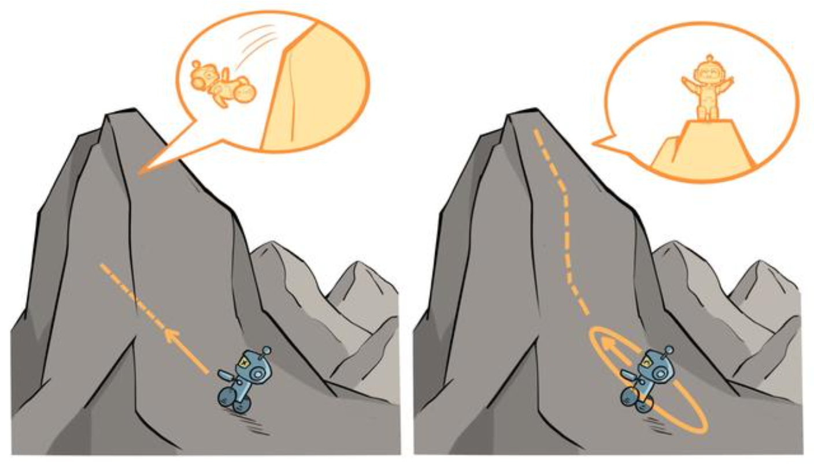
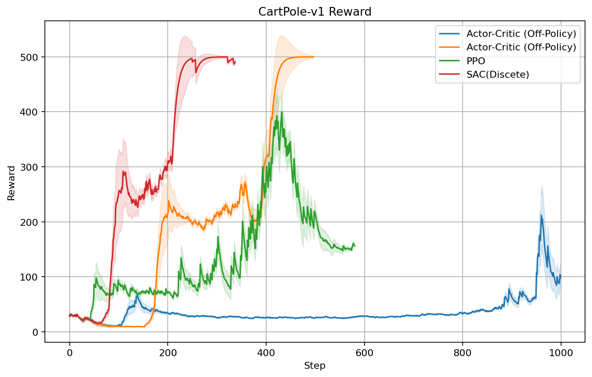
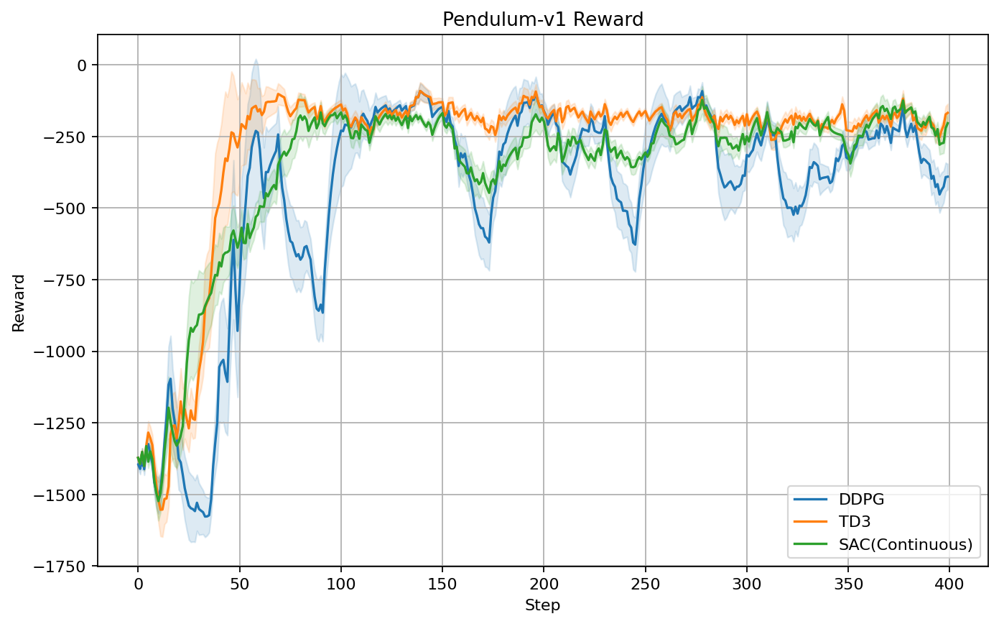

# Lab4: Actor Critic RL

> Keywords: Model-Free、Policy-based RL、Deep Reinforcement Learning

## 1. Abstract

本实验旨在系统性地介绍并对比多种**基于策略梯度**（policy gradient）的深度强化学习方法，涵盖从基础的 Actor-Critic 架构到近年来表现优异的算法，包括:

- PPO: Proximal Policy Optimization
- DDPG: Deep Deterministic Policy Gradient
- TD3: Twin Delayed DDPG
- SAC: Soft Actor-Critic

首先概述了强化学习问题的基本定义和价值函数的核心思想，然后重点阐述了 Actor-Critic 方法如何将价值函数估计（Critic）与策略优化（Actor）相结合。通过在离散与连续动作空间分别进行实验对比，可以观察到不同方法在训练效率、稳定性和探索能力上的差异。

实验结果表明，合适的价值函数估计和策略正则化机制（如最大熵、双重 Q 网络、目标平滑等）能显著提升学习性能和收敛稳定性，对大多数实际连续控制和离散控制任务都有良好的适用性。

## 2. Introduction

### 2.1 Basic Concepts

强化学习（Reinforcement Learning, RL）是一种通过与环境交互来学习如何在不同状态下采取合适的行动，以最大化累计奖励的机器学习方法。

在强化学习中，**智能体（Agent）**在每个时刻观察到当前**状态（State）**，执行一个**行动（Action）**，并从环境中获得一个**反馈奖励（Reward）**。通过多次尝试和反馈，智能体逐步学习出一套最优**策略（Policy）**，即在不同状态下采取的最优行动选择方法。

<div align=center>
    
    <br>
    <div style = "
        color: orange;
        border-bottom: 1px solid #d9d9d9;
        display: inline-block;
        color: #999;
        text-align: center;
        padding: 2px;">
        Figure 1. Reinforcement Learning
    </div>
    <p> </p>
</div>

----

#### 2.1.1 Definitions：

- **状态（State）** $s_t\in \mathcal S$ ：Environment 在某一时刻 $t$ 描述 **Agent** 的状态

- **观察（Observation）** $o_t\in \mathcal O$：**Agent** 对环境状态的部分或全部感知 $O \subseteq S$

- **动作（Action）** $a_t\in \mathcal A$：**Agent** 在给定状态下的可能行为。

- **即时奖励（Reward）** $R_t\in R: \mathcal S\times \mathcal A \times \mathcal S \rightarrow \mathcal R$ ：反馈信号，用于指示 **Agent** 采取的动作是否有利于实现目标。
  $$
  R_t=R(s_t,a_t,s_{t+1})
  $$
  
- **转移概率 (Transition Probability)** $\mathbb P: \mathcal S\times \mathcal A\rightarrow \mathcal R $，表示在给定当前状态 $s$ 和执行动作 $a$ 后，转移到其他状态 $s'$ 的概率$\mathbb P(s'|s,a)$。
  
  通常概率 $P$ 由外部环境本身决定，在 Model-Free RL 环境下，给定 $(s,a)$ ，转移后的状态 $s'$ 是确定的：
  $$
  \mathbb P(s'|s,a) = \delta(s'-\hat s)
  $$
  
- **策略（Policy）**：**Agent** 根据当前的状态 $s_t$ 会选取不同的行为 $a_t$，选择的方法叫做策略(Policy)，通常有两种类型：

  - stochastic: $a_t \sim \pi(\cdot|s_t)$，根据状态 $s_t$ ，按概率选择行动 $a_t$
  - deterministic：$a_t = \mu(s_t)$，根据状态 $s_t$ ，唯一确定行动 $a_t$，deterministic 是 stochastic 的一种特殊情况。

- **轨迹 (Trajectory)**: **Agent** 从初始状态 $s_0$ 出发，按照给定 **Policy** $\pi$ 下，得到的系列状态动作对：
  
  $$
  \tau = \{(s_t,a_t)\}_{t=0}^N
  $$
  
  通常在给定策略 $\pi$ 和转移概率 $\mathbb P$ 下，这样的轨迹 $\tau$ 符合分布 $\rho_\pi$，即：
  
  $$
  \tau\sim \rho_\pi
  $$

- **值函数（Value Function）**：用于评估给定**状态 $s$ 或状态-动作对 $(s,a)$ **的累积奖励， 是对未来收益的预期：
  
  $$
  G(\tau) = \sum_{t=0}^{\infty}R_t= \sum_{t=0}^{\infty}R (s_t,a_t,s_{t+1})
  $$
  
  **在多数情况下，我们更强调当下收益，同时保证未来收益足够大**，因此采用**值函数**定义如下：
  $$
  G(\tau) = \sum_{t=0}^{\infty} \gamma^t R(s_t,a_t),\quad\gamma\in(0,1)
  $$
  常用的值函数有以下两类定义：**==Bellman Equation==** 
  
  - **Value Function：** 指在当前状态 $s$ 下，执行策略 $\pi$ 获得的累积奖励：
    
    $$
    \begin{aligned}
    V^{\pi}(s)&=\mathbb E_{\tau\sim \rho_\pi}[G(\tau)|s_0=s]\\
    &=\mathbb E_{(s_t,a_t)\sim \rho_\pi}  \left[ \sum_{t=0}^{\infty} \gamma^t R(s_t,a_t,s_{t+1}) |s_0=s\right]\\
    &= \mathbb E_{a\sim \pi(\cdot|s)} \left[\mathbb E_{s'\sim P(\cdot|s,a)}\left[R(s,a,s')+\gamma V^\pi(s')\right]\right]
    \end{aligned}
    $$
  
  - **Action-Value Function:** 指在给定状态 $s$ 和当下执行的行动 $a$ 后得到的累积奖励：
    $$
    \begin{aligned}
    Q^{\pi}(s,a)&=\mathbb E_{\tau\sim\rho_\pi}[G(\tau)|s_0=s,a_0=a]\\
    &=\mathbb E_{s'\sim P(\cdot|s,a)}\left[R(s,a,s')+\gamma \mathbb E_{a'\sim \pi(\cdot{|s'})}[Q^{\pi}(s',a')])\right]
    \end{aligned}
    $$
  - **Relation:**   
    $$
    V^{\pi}(s)=\mathbb E_{a\sim \pi(\cdot|s)} \left[Q^\pi(s,a)\right]
    $$
    
    $$
    Q^{\pi}(s,a) =\mathbb E_{s'\sim P(\cdot|s,a)}\left[R(s,a,s')+\gamma V^\pi(s') \right]
    $$

### 2.2 Reinforcement Learning Algorithms

#### 2.2.1 Classification

基于强化学习的算法分类有很多，一种分类方式是以**是否对环境建模(Model)为分类依据：**

- **Model-Based RL:** 学习构建环境的 $P(s'|s,a)$ 和 $R(s,a,s')$ 来进行决策，通过建立环境的模型，规划一系列行动。
- **Model-Free RL:** 直接与环境交互，根据获取到的收益，找到最优策略 $\pi(a|s)$ 指导 Agent 行为。在 Model-Free RL中，给定 $a,s$ 下， $R,s'$ 是已知的（可计算的，数据采集的），无需优化建模推断。

> If you want a way to check if an RL algorithm is model-based or model-free, ask yourself this question: after learning, can the agent make predictions about what the next state and reward will be before it takes each action?
>
> If the agent can do, it's model-based.

**我们主要探讨 Model-Free RL**

<div align=center>
    
    <br>
    <div style = "
        color: orange;
        border-bottom: 1px solid #d9d9d9;
        display: inline-block;
        color: #999;
        text-align: center;
        padding: 2px;">
        Figure 2. RL Algorithms
    </div>
    <p> </p>
</div>


---

#### 2.2.2 Model-Free RL

> Targets: Optimal Value Functions

粗略来说，**Model-Free 强化学习任务就是找到一个策略 $\pi$ ，使得回报 $G$ 尽可能多。**

定义最优策略 $\pi^*$:

$$
\pi^* = \arg\max_\pi V^\pi(s),\quad \forall s\in \mathcal S
$$

最优策略 $\pi^*$ 对应的价值函数即为：最优价值函数 (Optimal Value Functions):

$$
V^*(s) = \max_\pi V^\pi(s),\quad \forall s\in  \mathcal S
$$

对应的也存在一个最优的行为价值函数：

$$
Q^*(s,a)=  \max_\pi Q^\pi(s,a),\quad \forall s\in  \mathcal S, a\in\mathcal A
$$

基于以上定义，可以将 **Model-Free RL** 划分为以下两类学习算法：

- **Policy-Based:** 定义合适的目标函数 $\mathcal J(\theta)$ ，直接对策略 $\pi_\theta(a|s)$ 进行建模和优化
- **Value-Based:** 依据 **Bellman** 通过构造并逼近价值函数 $V_\phi(s)$ or $Q_{\phi}(s,a)$ ,间接学习最佳策略 $\mu(s)=\arg \max_a Q(s,a)$

> Value-Based Method 在 [Lab1](../exp1-Classical-RL), [Lab2](../exp2-Deep-Q-Learning) 中都已介绍，分别是关于经典Q-Learning算法，Deep Q-Learning 算法，在此不多赘述。

### 2.3 Policy-Based Method: Policy Gradient

值函数的方法里的策略是隐式的，比如$\mu(s)=\arg \max_a Q(s,a)$)。而 **Policy-Based Method** 不同，它直接有一个参数化的策略 $\pi_\theta(a|s)$ (比如是一个神经网络，或者一个表格)，**`Policy Gradient`** 通过直接求Reward对策略函数的参数的梯度来不断的找到更好的策略(参数)，使得期望的Reward越来越大。

因此，我们优化的对象是**策略 $\pi_\theta$**，对应采样的**轨迹 trajectory** 是 $\tau=(s_0,a_0,...,s_{T+1}=Final)$，采样概率 $\rho_{\theta}(\tau)$ 由 $\pi_\theta(a|s)$ 和环境固有转移概率 $\mathbb P(s'|s,a)$ 决定：

$$
\rho_{\theta}(\tau) = \prod_{t=0}^T\pi_\theta(a_t|s_t)\mathbb P(s_{t+1}|s_t,a_t)
$$

优化的目标是在当前策略 $\pi_\theta$下最大化 Reward 的期望:

$$
\begin{aligned}
\max \mathcal J(\theta) &= \mathbb E_{\tau\sim\rho_{\theta}(\tau)}\left[\sum_{t=0}^{T}R_t\right]=\mathbb E_{\tau\sim\rho_{\theta}(\tau)}[G(\tau)]\\
&=\int \rho_{\theta}(\tau)G(\tau)d\tau
\end{aligned}
$$

对应的导数为：

$$
\begin{aligned}
\nabla \mathcal J(\theta)&=\int \nabla \rho_\theta(\tau)G(\tau)d\tau=\int \rho_{\theta}(\tau)\nabla\log(\rho_\theta(\tau)) G(\tau)d\tau\\
&= \mathbb E_{\tau\sim\rho_{\theta}(\tau)}\left[\nabla\left(\sum_{t} \log \pi_\theta(a_t|s_t)+\log \mathbb P(s_{t+1}|s_t,a_t)\right)\cdot G(\tau)\right]\\
&=\mathbb E_{\tau\sim\rho_{\theta}(\tau)}\left[\nabla\left(\sum_{t} \log \pi_\theta(a_t|s_t)\right)\cdot G(\tau)\right]\\
&=\mathbb E_{\tau\sim\rho_{\theta}(\tau)}\left[\nabla\left(\sum_{t=0}^T \log \pi_\theta(a_t|s_t)\right)\cdot\sum_{t=0}^TR(s_t,a_t,s_{t+1})\right]\\
\end{aligned}
$$

如果我们按照  $\pi_\theta(a|s)$  来采样路径 $\tau\sim\rho_{\theta}(\tau)$，根据 **Monte Carlo 重要性积分方法**，我们取采样数目 $N=1$, 那么：

$$
\nabla \mathcal J(\theta)\approx \nabla\left(\sum_{t=0}^T \log \pi_\theta(a_t|s_t)\right)\cdot\sum_{t=0}^TR(s_t,a_t,s_{t+1})\\
$$

> 这里我们考虑是按照 $\pi_\theta(a|s)$ 采样一条完整路径的Reward，因此算法是 **On-Policy** 的；
>
> 同时假设了 $\pi$ 分布是随机的(stochastic)，因为确定性策略( deterministic ) 只是前者的一类特殊情况( $\delta$ 分布 )。

根据”因果性”，我们认为 $a_t$ 只能影响 $t$ 及其之后时刻的reward, 因此：
$$
\begin{aligned}
\nabla \mathcal J(\theta)&\approx \nabla\left(\sum_{t=0}^T \log \pi_\theta(a_t|s_t)\cdot\sum_{t'=t}^TR(s_{t'},a_{t'},s_{t'+1})\right)\\
&=\nabla\left(\sum_{t=0}^T \log \pi_\theta(a_t|s_t)\cdot G(\tau_t|s_0=s_t,a_0=a_t)\right)\\
&\approx\nabla\left(\sum_{t=0}^T \log \pi_\theta(a_t|s_t)\cdot Q(s_t,a_t)\right)
\end{aligned}
$$
在深度学习中，我们可以利用神经网络来训练参数 $\theta$，对应的损失函数化简后为：
$$
\mathcal L_{\pi}(\theta) = - \sum_{t=0}^T \log \pi_\theta(a_t|s_t)\cdot Q(s_t,a_t)
$$

可以看到，这个损失函数的定义本质上是交叉熵损失率 (**Cross Entropy Loss**)，$Q(s_t,a_t)$ 为训练标签，$\pi_\theta$ 为待训练的概率分布。

传统的RL 算法中，有多种估计 $Q(s_t,a_t)$ 的方法，比如 **`REINFORCE`** 算法就是直接估计一条路径上所有的 reward 来估计 $Q(s_t,a_t)$。

```python
# REINFORCE
# policy_net = PolicyNet(state_dim, hidden_dim, action_dim)
reward_list = transition_dict['rewards'] # (T,1)
state_list = transition_dict['states'] # (T,state_dim)
action_list = transition_dict['actions'] # (T,action_dim)
G = 0
optimizer.zero_grad()
for i in reversed(range(len(reward_list))):  # 从最后一步算起
      reward = reward_list[i]
      state = torch.tensor([state_list[i]],
                                 dtype=torch.float)
      action = torch.tensor([action_list[i]]).view(-1, 1)
      log_prob = torch.log(policy_net(state).gather(1, action))
      G = self.gamma * G + reward
      loss = -log_prob * G  # 每一步的损失函数
      loss.backward()  # 反向传播计算梯度
optimizer.step()  # 梯度下降
```

## 3. Actor Critic RL

`Actor-Critic RL` 算法是强化学习中一种结合了策略优化 (**Policy-Based, Actor-Only**) 和价值估计 (**Value-Based, Critic-Only**) 的混合方法，它结合了二者优点，以提高学习效率和稳定性。但

从本质上来看，`Actor-Critic RL` 算法是基于策略的算法，因为这一系列算法的目标都是优化一个带参数的策略 $\pi_\theta$ ，只是会额外学习价值函数 $V_\omega$ ，从而帮助策略函数 $\pi_\theta$ 更好地学习优化，类似于深度学习中的 `Generative Adversarial Network` (**GAN**) 的模型框架：

`Actor-Critic RL` 是一种优化框架，它并不依赖于 **Actor** 和 **Critic** 的具体形式。

- **Actor**：按照策略 $\pi_\theta(a|s)$ 与环境交互，采样当前的动作 $a_t$，并在 Critic 利用价值函数 $V_\omega$ 的指导下进行优化
- **Critic**：利用 Actor 执行的策略 $\pi_\theta(a|s)$ 与环境交互获取的轨迹数据 $\mathcal D$ ，来优化价值函数 $V_\omega$



### 3.1 Advantage Value Function

> - On-Policy
> - Discrete Action Spaces
> - Stochastic Policy

#### 3.1.1 Critic

对于 **Critic**，优化的目标为 Value Function $V_\phi(s_t)$ :

```python
class ValueNet(nn.Module):
    def __init__(self, obs_dim, hidden_dim=128):
        super(ValueNet, self).__init__()
        self.net = nn.Sequential(nn.Linear(obs_dim, hidden_dim), 
                                nn.ReLU(), 
                                nn.Linear(hidden_dim, 1))
    def forward(self, obs):
        return self.net(obs)
```

我们利用基于值的**时间差分算法 (temporal difference，TD)** 来优化 $V_\theta(s_t)$，即对于单个数据 $(s_t,a_t,r_{t},s_{t+1})$ 定义如下价值函数的损失函数：

$$
\begin{aligned}
\mathcal{L}_{\text{Cirtic}}(\phi) = S&\mathbb E\left[(V_{\text{tgt}}(s_t)-V_\phi(s_t))^2\right]\\
V_{\text{tgt}}(s_t)\approx r_t+\gamma &V_\phi(s_{t+1}),\quad (\text{require\_grad=Flase})
\end{aligned}
$$

这里利用单步的估计来近似。

#### 3.1.2 Actor

对于 **Actor**，优化的目标为 Policy $\pi_\theta(a|s)$: **离散动作空间**

```python
class PolicyNet(nn.Module):
    def __init__(self, obs_dim, act_dim, hidden_dim=128):
        super(PolicyNet, self).__init__()
        self.net = nn.Sequential(nn.Linear(obs_dim, hidden_dim),
                                nn.ReLU(), 
                                nn.Linear(hidden_dim, act_dim))
    def forward(self, obs):
        logits = self.net(obs)
        return logits, torch.log_softmax(logits, dim=-1)
```

根据策略梯度法 (Policy Gradient)，可以把梯度定义成如下更一般的形式：

$$
g=- \sum_{t=0}^T\Psi_t\nabla_\theta\log\pi_\theta(a_t|s_t)
$$

其中，$\Psi_t$ 有很多形式：

1. $G(\tau|s_0,a_0)$ 轨迹总回报
2. $G(\tau|s_t,a_t)$ 当前动作 $a_t$ 之后的回报
3. $Q(s_t,a_t)$ Action Value Function
4. $A(s_t,a_t)=Q(s_t,a_t)-\mathbb E_{a} Q(s_t,a) = Q(s_t,a_t)-V(s_t)$ 

对应的损失函数为：

$$
\mathcal L_{\text Actor} = \mathcal L_{\pi}(\theta) =- \sum_{t=0}^T\Psi_t\log\pi_\theta(a_t|s_t)
$$

我们主要关注最后一种优势函数 (**Advantage Value Function**)，作为指导 $\pi_\theta$ 训练的指标，选择优势函数有如下几个原因：

- 如果直接估计 **Action Value Function** 可能因为Value Function 可能由于数值过大，导致在估计时产生的方差偏大，因此采用 **Advantage Value Function**，通过减去基线函数 **baseline function** 来减少方差.
- 
  $$
  \mathbb E_{s,a}\left[(Q-\mathbb E_{s,a}[Q])^2\right]\ge\mathbb E_{s,a}\left[(Q-\mathbb E_{a}[Q])^2\right]
  $$
  
- 从 **Advantage Value Function** 形式上看，我们使用 $A(s,a)$ 来指导 $\pi_\theta(a|s)$，可以使得 $\pi$ 更加关注当前状态 $s_t$ 选择动作 $a_t$ 带来的收益相对于平均值的情况。
  $$
  \min_\theta\mathcal L_{\text{Actor}}(\theta) = -\max_{\theta} \sum_{t=0}^T \log \pi_\theta(a_t|s_t)\cdot A(s_t,a_t)
  $$
  
  当 $A(s_t,a_{+})$ > 0 时，$\pi_\theta(a_+|s_t)$ 倾向于值为1，$\log\pi_\theta\rightarrow 0$，使得策略更加倾向于选择动作 $a_{+}$

  当 $A(s_t,a_-)$ < 0 时，$\pi_\theta(a_-|s_t)$ 倾向于值为 $0$，$\log\pi_\theta\rightarrow -\infty$，使得策略不倾向于选择动作 $a_{+}$

在实际代码实现时，考虑到我们采用的价值函数为 $V_\phi(s_t)$，因此采用**时间差分(temporal difference, TD)** 的方式间接近似 $A(s_t,a_t)$

$$
A(s_t,a_t)=Q(s_t,a_t)-V_\theta(s_t)\approx R(s_t,a_t)+\gamma V_\theta(s_{t+1})-V_\theta(s_t)
$$

#### 3.1.3 Code

```python
def update(self, transition):
    states, actions, rewards, next_states, dones = transition #[T, ...]
    td_target = rewards + self.gamma * (1 - dones) * self.critic(next_states)
    td_eval = self.critic(states)
    # Actor Loss
    td_error = td_target - td_eval # TD
    log_probs, probs = self.actor.get_log_probs(states)
    # On-Policy, action is sampled from the current policy  a ~ π(a|s)
    log_probs = log_probs.gather(dim=1, index=actions)
    actor_loss = -(log_probs * td_error.detach()).mean()
    # Critic Loss
    critic_loss = nn.MSELoss()(td_eval, td_target.detach())
    # Update Cirtic and Actor
    self.critic_optimizer.zero_grad()
    self.actor_optimizer.zero_grad()
    critic_loss.backward()
    actor_loss.backward()
    self.critic_optimizer.step()
    self.actor_optimizer.step()
```

---

### 3.2 Proximal Policy Optimization (PPO)

> - On-Policy
> - Discrete Action Space
> - Stochastic Policy

3.1中的 Actor-Critic 算法虽然简单、直观，但在实际应用过程中会遇到训练不稳定的情况。具体来说，当策略网络是深度模型时，沿着策略梯度 $\pi_\theta$ 更新参数 $\theta$ ，很有可能由于步长 $\alpha_\theta$ 太长，策略突然显著变差，进而影响训练效果。

<div align=center>
    
    <br>
    <div style = "
        color: orange;
        border-bottom: 1px solid #d9d9d9;
        display: inline-block;
        color: #999;
        text-align: center;
        padding: 2px;">
        Figure 3. Proximal Policy Optimization
    </div>
    <p> </p>
</div>

出于以上考虑，我们希望在梯度更新时，合理限制梯度大小，使得相邻两次策略更新后的参数$\theta_{k}$ 和 $\theta_{k+1}$ 之间差距不能太大。
$$
\theta_{k+1}\leftarrow \arg\min_\theta \mathcal L(\theta|\theta_k),\quad s.t. ||\theta-\theta_k||\le \epsilon
$$
其中，$\mathcal L$ 是策略 $\pi_\theta$ 的损失率。

#### 3.2.1 Training: Mini-batch

PPO算法训练时，通常对同一批数据 $\tau$ 进行多次小批量 (**Mini-batch**) 来优化目标函数，更加充分利用已有数据，提高样本效率。

但这会导致采样轨迹 $\tau$ 的策略分布 $\pi_{\theta_k}(a_t|s_t)$ 和正在优化的策略 $\pi_{\theta}$ 不一致的问题，因此需要合理定义损失函数 $\mathcal L$ (或者期望收益 $\mathcal {J}$).

考虑 Eq.(21) 定义的损失函数的梯度 $g =\nabla\mathcal L_\pi$ ，其保证了采样策略和训练策略的一致性，我们为了方便讨论，假设 **minibatch=1**，那么单步优化的梯度为：
$$
\nabla\mathcal L_{\pi}(\theta) = -\nabla\log\pi_\theta(a_t|s_t)\cdot\Psi(s_t,a_t)=-\frac{\nabla\pi_\theta(a_t|s_t)}{\pi_\theta(a_t|s_t)}\cdot\Psi(s_t,a_t)
$$
由于上式 $a_t$ 是对 $\pi_\theta(a_t)$的重要性采样得到的分布，因此上式改写为更一般的形式：
$$
\nabla\mathcal L_{\pi}(\theta) =\mathbb E_{a_t\sim \pi_\theta(a_t|s)}\left[-\frac{\nabla\pi_\theta(a_t|s_t)}{\pi_\theta(a_t|s_t)}\cdot \Psi(s_t,a_t)\right]=\int_{\mathcal A} -\nabla \pi_{\theta}(a_t|s_t)\cdot \Psi(s_t,a_t)da_t
$$
此时训练后的策略 $\pi_\theta$ 会按照 $\Psi$ 价值函数的定义趋向于选择价值 $\Psi(\cdot|s_t)$ 更大的动作 $a_t$. 

但是，考虑到在 **Minibatch** 训练方式下，会导致在一个训练步中 $\pi_\theta$ 多次更新，因此实际上 $a_t$ 是来自训练前，上一次训练得到的 $\pi_{\theta_k}$ 的采样，所以根据重要采样积分方法(Important Sampling)，我们将积分改写为 $\pi_{\theta_k}$ 分布采样期望的形式
$$
\nabla L_\pi(\theta|\theta_k) =\mathbb E_{a_t\sim \pi_{\theta_k}(a_t|s)}\left[-\frac{\nabla\pi_{\theta}(a_t|s_t)}{\pi_{\theta_k}(a_t|s_t)}\cdot \Psi(s_t,a_t)\right]
$$
那么仍然取采样数为 $N=1$ 时，修正后的损失函数为：
$$
\mathcal L_{\pi}(\theta|\theta_k) = \frac{\pi_{\theta}(a_t|s_t)}{\pi_{\theta_k}(a_t|s_t)} \Psi(s_t,a_t)
$$

> 注：
>
> - 虽然多次说采样策略 $\pi_{\theta_k}$ 和待优化策略不一致 $\pi_{\theta}$，但是这不是 Off-Policy，因为针对一个完整的迭代步，并没有使用其他的策略来采样产生样本，因此 **PPO** 算法是 On-Policy.
> - 虽然 PPO 针对了 $\pi_{\theta_k}$ 采样产生的动作 $a_t$ 进行了修正，但没有对状态 $s_t$ 的分布进行修正，而是假设了当优化策略变化不大时， $s_t$ 服从的分布变化不大。

#### 3.2.2 PPO-Clip

前面提到，**PPO** 是为了避免训练时策略更新变化过大，导致训练不稳定或性能崩溃。**PPO** 的前身是

**TRPO** 算法，通过在 KL 散度（Kullback–Leibler Divergence）上施加硬约束或者软约束，来保证新旧策略之间不会差别太大。**PPO** 算法在 **TRPO** 基础上采用了更加简化的方式来约束策略参数的更新，具体来说：
$$
\mathcal L^{\text{CLIP}}(\theta|\theta_k)=\min\left(\frac{\pi_{\theta}(a_t|s_t)}{\pi_{\theta_k}(a_t|s_t)}\Psi(s_t,a_t),g(\epsilon,\Psi(s_t,a_t))\right)
$$

其中：
$$
g(\epsilon,\Psi)=\begin{cases}
(1+\epsilon) \Psi \quad\Psi\ge 0\\
(1-\epsilon) \Psi \quad\Psi < 0
\end{cases}
$$
在实际实现中，我们采用 $\Psi = A(s_t,a_t)$ 优势函数作为我们的衡量动作优劣的指标。

#### 3.2.3 Code

```python
def update(self, transition):
    states, actions, rewards, next_states, dones = transition        
    td_target = rewards + self.gamma * (1 - dones) * self.critic(next_states)
    td_error = td_target - self.critic(states)
    advantage = compute_advantage(self.gamma, self.lmbda, td_error.cpu()).to(states.device)
    log_probs_old, _ = self.actor.get_log_probs(states)
    log_probs_old = log_probs_old.gather(dim=1, index=actions).detach()
    # Mini-batch update
    for _ in range(self.epochs):
        log_probs, _ = self.actor.get_log_probs(states)
        log_probs = log_probs.gather(dim=1, index=actions)
        ratio = (log_probs - log_probs_old).exp()
        actor_loss1 = ratio * advantage
        actor_loss2 = torch.clamp(ratio, 1 - self.epsilon, 1 + self.epsilon ) * advantage
        actor_loss = -torch.min(actor_loss1, actor_loss2).mean()
        critic_loss = nn.MSELoss()(self.critic(states), td_target.detach())
        self.actor_optimizer.zero_grad()
        self.critic_optimizer.zero_grad()        
        actor_loss.backward()
        critic_loss.backward()
        self.actor_optimizer.step()
        self.critic_optimizer.step()
```

----

### 3.3 Deep Deterministic Policy Gradient (DDPG)

> - Off-Policy
> - Continuous Action Spaces
> - Deterministic Policy

DDPG 是一种针对**连续动作空间**的基于策略梯度（policy gradient) 的深度强化学习算法，它可以视作将 **DQN** 中的 **`Replay Buffer` + `Target Network`** 机制，结合 **Deterministic Policy Gradient (DPG)** 的框架而形成的一种 **Actor-Critic** 方法。

#### 3.3.1 Training: Off-Policy

在前面介绍的算法中，都是 **On-Policy** 的，这意味着它们训练时，每个轨迹 $\tau_k$ 在被使用后就丢弃了，样本效率比较低，可以考虑类似于 **DQN** 算法，采用 **Off-Policy** 训练方式进行训练。

##### **Replay Buffer**

打破数据间的相关性，并且重复利用过往经验样本，提高样本效率。

- Sample: 维护一个固定容量的环形缓冲区 $\mathcal{D}$，将交互过程中的 $(s_t, a_t, r_t, s_{t+1})$ 依次存入。当容量满了就覆盖最旧的数据。
- Train: 从缓冲区中**随机均匀采样**一个 mini-batch ，然后计算 Critic 损失和 Actor 的梯度。

##### **Target Network** 

让训练更稳定，避免目标值随网络更新而产生过大震荡。

此时我们共需要维护 **4个网络**，**Actor** 和 **Critic** 各两个，分别为：

- `Sample Network`: 用于与环境交互，采样收集数据，每次训练都会更新的对象。
- `Target Network`: 用于计算参考值，采用软更新的方式，更新速度较慢。
  
  ```python
  def soft_update(sample_net, target_net, tau=0.01):
      for param, target_param in zip(net.parameters(), target_net.parameters()):
          target_param.data.copy_(tau * param.data + (1 - tau) * target_param.data)
  ```

#### 3.3.2 Deterministic Policy Gradient

##### Network

在随机策略梯度方法中，策略 $\pi_\theta(a|s)$ 通常是一个概率分布。然而在连续动作空间 $ \mathcal A=\mathbb R^{N}$ 中，有时直接输出一个确定动作 $a = \mu_{\theta}(s)$ 会更简单高效。因此 **`Policy Network`** 直接输出对应状态的

```python
class PolicyNet(torch.nn.Module):
    def __init__(self, obs_dim, hidden_dim, act_dim, action_bound):
        super(PolicyNet, self).__init__()
        self.fc1 = torch.nn.Linear(obs_dim, hidden_dim)
        self.fc_mu = torch.nn.Linear(hidden_dim, act_dim)
        self.action_bound = action_bound

    def forward(self, x, deterministic=False):
        x = F.relu(self.fc1(x))
        mu = self.fc_mu(x)
        action = torch.tanh(mu) * self.action_bound
        log_prob = None
        return action, log_prob
```

相对应的 **`Q Value Network`** 对应 $a_t,s_t$ 的值:

```python
class QValueNet(torch.nn.Module):
    def __init__(self, obs_dim, act_dim, hidden_dim=128):
        super(QValueNet, self).__init__()
        self.fc1 = torch.nn.Linear(obs_dim + act_dim, hidden_dim)
        self.fc2 = torch.nn.Linear(hidden_dim, hidden_dim)
        self.fc_out = torch.nn.Linear(hidden_dim, 1)

    def forward(self, x, a):
        # print(x.shape, a.shape)
        cat = torch.cat([x, a], dim=1)
        x = F.relu(self.fc1(cat))
        x = F.relu(self.fc2(x))
        return self.fc_out(x)
```

##### Explore

但是，由于 Actor 输出的是一个确定性动作，如果完全使用 $\mu(s)$ 行动，探索性不足。DDPG 需要在环境交互阶段向输出的动作中添加**噪声**，即：在每一步向 Actor 输出加一个独立的高斯噪声 $\mathcal{N}(0, \sigma)$，增强探索。探索时执行的策略可写为：

$$
a_t = \mu_\theta(s_t)+\mathcal N(0,\sigma)
$$

#### 3.3.3 Loss

##### Critic Loss

对于 **Critic** 我们采用与 **DQN** 算法相同的更新方式：TD Error，不同的是我们采用 **Actor** 的Target 网络输出确定性动作作为参考值：

$$
\begin{aligned}
\mathcal{L}_{\text{Cirtic}}(\phi|s_t,a_t,r_t,s_{t+1}) = (Q^{\text{tgt}}-Q_\phi(s_t,a_t))^2\\
Q^{\text{tgt}}=r_t+\gamma Q^{\text{tgt}}_\phi(s_{t+1},\mu^{\text{tgt}}(s_{t+1}))
\end{aligned}
$$

##### Actor Loss

对于 **Actor**，考虑到我们采用了 **Off-Policy** 的训练方式，可以认为此时抽样得到的数据和训练的策略是”近似独立“的，因此可以认为我们获得的采样数据是均匀分布 $(a_t,s_t)\sim \mathcal U$  ，我们采用最直接的期望回报 Reward 作为损失函数：

$$
\begin{aligned}
\mathcal L_{\text{actor}}(\theta|s_t) &= -Q(s_t,\mu_\theta(s_t)\\
\nabla \mathcal L_{\text{actor}}(\theta) = -\nabla_a& Q(s_t,a)|_{a=\mu(s_t|\theta)}\cdot\nabla_\theta \mu(s_t|\theta)
\end{aligned}
$$

这样定义的损失函数优化后，符合我们对最佳确定性动作 $\mu^*$ 的预期

$$
\mu^* = \arg\max_\mu Q(s_t,\mu)
$$

#### 3.3.4 Code

```python
def update(self, transition):
    states, actions, rewards, next_states, dones = transition #[batch_size, ...]
    with torch.no_grad():
        next_actions, _ = self.target_actor(next_states, deterministic=True)
        next_actions = next_actions.view(-1, 1)
        q_next = self.target_critic(next_states, next_actions)
        q_target = rewards + self.gamma * (1 - dones) * q_next
    q_values = self.critic(states, actions)  # [batch_size, 1]
    # Critic Loss: Minimize TD error
    critic_loss = nn.MSELoss()(q_values, q_target)
    self.critic_optimizer.zero_grad()
    critic_loss.backward()
    self.critic_optimizer.step()
    # Actor Loss: Maximize Q value
    actions, log_probs = self.actor(states)
    q_values = self.critic(states, actions) # [batch_size, 1]
    actor_loss = -(q_values).mean()
    self.actor_optimizer.zero_grad()
    actor_loss.backward()
    self.actor_optimizer.step()
    # Soft Update
    soft_update(self.actor, self.target_actor, self.tau)
    soft_update(self.critic, self.target_critic, self.tau) 
```

### 3.4 Twin Delayed DDPG (TD3)

> - Off-Policy
> - Continuous Action Spaces
> - Deterministic Policy

**TD3**由 Scott Fujimoto 等人在 2018 年提出，用于解决 **DDPG** 中常见的一些过高估计（overestimation）和训练不稳定问题。它整体仍然是一个**Actor-Critic**架构，属于**确定性策略（Deterministic Policy）**的强化学习方法。

TD3 之所以被称为“Twin Delayed DDPG”，主要是因为它在 DDPG 的框架上做了三大改进。

#### 3.4.1 Twin Critics

在 DDPG 中，只有一个 Critic 网络 $Q(s,a|\phi)$，它在计算目标值时可能出现**过估计**问题：由于函数逼近和梯度更新方式，Critic 往往会高估真实的 Q 值，从而导致策略学到不稳定或次优行为。

**双重 Critic（Twin Critics）**：借鉴 **Double Q-Learning** 的思想，通过同时训练两个独立的 Critic 网络 $Q_1(s,a|\phi_1), Q_2(s,a|\phi_2) $ 来减轻 Q 值过估计。在更新时取它们的**最小值**作为 Target Q 值:

$$
Q^{\text{tgt}}=r+\gamma\min\left( Q^{\text{tgt}}_1(s,\hat\mu^{\text{tgt}}(s)|\phi_1),Q^{\text{tgt}}_2(s,\hat\mu^{\text{tgt}}(s)|\phi_2))\right)
$$

所以 **TD3** 算法共需要维护 **6 个网络**。

#### 3.4.2 Target Policy Smoothing

在计算下一时刻目标 Q 值时，DDPG 直接把 “Target Actor” 给出的动作 $\mu^{\text{tgt}}(s)$ 作为输入。这样在高维连续动作环境中，会因对动作输入的微小偏差而造成 Critic 输出的大波动，从而使学习不稳定。

**目标动作平滑（Target Policy Smoothing）**：在 Critic 的目标计算中，对动作加一些小的随机噪声，以减小学习目标的不稳定，起到类似 Conservative Q-Learning 的平滑效果:

$$
\hat \mu^{\text{tgt}}(s) = \mu^{\text{tgt}}(s)+\text{CLIP}(\mathcal N(0,\sigma),-c,c)
$$

#### 3.4.3 Delayed Update

DDPG 在每一步都要更新一次 Actor 与 Critic，容易使 Actor 的更新过于频繁，对 Critic 估计的不稳定非常敏感。

**延迟更新（Delayed Update）**：Critic 仍然可以在每个时间步都做一次更新，但是 **Actor** 和 **Target Net** 只在每隔 d 步（通常 d=2）时才更新一次。这样可以给 Critic 网络更多时间去拟合 Q 函数，减少 Actor 受到不准 Q 值的负面影响.

#### 3.4.4 Code

```python 
def update(self, transition):
    self.global_step += 1
    states, actions, rewards, next_states, dones = transition
    actions = actions.view(-1, 1).float()
    with torch.no_grad():
        noise = (torch.randn_like(actions) * self.policy_noise).clamp(-self.noise_clip, self.noise_clip)
        next_actions, _ = self.target_actor(next_states, deterministic=True)
        next_actions = (next_actions + noise).clamp(-self.action_bound, self.action_bound)
        q_next1 = self.target_critic1(next_states, next_actions)
        q_next2 = self.target_critic2(next_states, next_actions)
        q_next = torch.min(q_next1, q_next2)
        # Q target 
        q_target = rewards + self.gamma * (1 - dones) * q_next
    q_values1 = self.critic1(states, actions)  # [batch_size, 1]
    q_values2 = self.critic2(states, actions)  # [batch_size, 1]
    # Critic Loss: Minimize TD error
    critic_loss1 = nn.MSELoss()(q_values1, q_target)
    critic_loss2 = nn.MSELoss()(q_values2, q_target)
    self.critic1_optimizer.zero_grad()
    critic_loss1.backward()
    self.critic1_optimizer.step()
    self.critic2_optimizer.zero_grad()
    critic_loss2.backward()
    self.critic2_optimizer.step()
    # Actor Loss: Maximize Q value
    if self.global_step % self.policy_delay == 0:
        actions_pred, _ = self.actor(states, deterministic=True)
        actor_loss = -self.critic1(states, actions_pred).mean()
        self.actor_optimizer.zero_grad()
        actor_loss.backward()
        self.actor_optimizer.step()
        # Soft Update
        soft_update(self.actor, self.target_actor, self.tau)
        soft_update(self.critic1, self.target_critic1, self.tau)
        soft_update(self.critic2, self.target_critic2, self.tau)
```

### 3.5 Soft Actor-Critic (SAC)

> - Off-Policy
> - Discrete and Continuous Action Spaces
> - Stochastic Policy

在 3.3 **DDPG**, 3.4 **TD3** 提到的算法面对连续的动作空间，学习的都是确定性策略 $\mu(s)$ （**Deterministic Policy**）。然而，这类算法在与环境交互时，需要额外在动作上人为加噪声来保证探索；一旦噪声设置不当，会面临**探索不足、过估计、易陷入局部最优以及对超参数敏感**等问题。

因此针对以上问题，**SAC**在 DDPG/TD3 的基础上做出了以下三个方面的改进。

#### 3.5.1 Stochastic Policy

首先，为了解决确定性策略（Deterministic Policy）带来的探索性不足的问题，**SAC** 直接学习**随机策略（Stochastic Policy）**，在输出层得到动作分布参数，我们主要讨论连续动作空间的处理方式，对于离散动作空间很容易推广。

针对连续动作空间，`Policy Network` 通常输出高斯分布参数 $\mu_\theta(s), \sigma_\theta(s)$, 再通过 **Reparameterization ** 方法保证策略输出的随机性：

$$
a = \tanh(\mu_\theta(s)+\sigma_\theta(s)\odot \epsilon),\quad \epsilon\sim \mathcal N(0,1)
$$

```python
class PolicyNet(torch.nn.Module):
    def __init__(self, obs_dim, hidden_dim, act_dim, action_bound):
        super(PolicyNet, self).__init__()
        self.fc1 = torch.nn.Linear(obs_dim, hidden_dim)
        self.fc_mu = torch.nn.Linear(hidden_dim, act_dim)
        self.fc_std = torch.nn.Linear(hidden_dim, act_dim)
        self.action_bound = action_bound

    def forward(self, x, deterministic=False):
        x = F.relu(self.fc1(x))
        mu = self.fc_mu(x)
        std = F.softplus(self.fc_std(x)) # log(1+exp(x))
        if deterministic:
            log_prob = None
            action = torch.tanh(mu) * self.action_bound
            return action, log_prob
        else:
            dist = Normal(mu, std)
            normal_sample = dist.rsample() # reparameterization
            log_prob = dist.log_prob(normal_sample)
            action = torch.tanh(normal_sample)
            log_prob = log_prob - torch.log(1 - torch.tanh(action).pow(2) + 1e-7)
            action = action * self.action_bound
            return action, log_prob
```

> SAC 算法也借鉴了Double Q-Leaning 算法，因此也有6个待优化的网络，Policy Network 2 个, Q Value Network 4 个

#### 3.5.2 Maximum Entropy

**最大熵强化学习**（maximum entropy RL）的思想就是在优化目标中同时最大化“回报”与“策略熵”，即希望策略**既能拿到高回报，又要保持足够的随机性**。目标可以写为：

$$
\begin{aligned}
\mathcal J(\theta|s_t)&=\mathbb E_{a\sim\pi_\theta(\cdot|s_t)}\left[Q(s_t,a)\right]+\alpha \mathcal H(\pi_\theta(\cdot|s_t))\\
&=\mathbb E_{a\sim\pi_\theta(\cdot|s_t)}\left[Q(s_t,a)-\alpha\log\pi_\theta(a_|s_t)\right]
\end{aligned}
$$

即在相比原本的RL算法，SAC 只是在原来价值函数后多了一个熵值项 $\mathcal H$ 作为正则项约束，以增加策略 $\pi_\theta$ 的随机性。

如果我们利用**变分法**，可以得到在状态 $s_t$ 下优化的最佳策略 $\pi^*$

$$
\begin{aligned}
\pi^*(a|s_t)&=\arg\max_\pi \int_{\mathcal A} [Q(s_t,a)-\alpha\log\pi(a|s_t)]\pi(a|s_t)d a\\
&=\frac{\exp(\frac{1}{\alpha}Q(s_t,a))}{\int_{\mathcal A}\exp(\frac{1}{\alpha}Q(s_t,a))da}
\end{aligned}
$$

> 观察这个式子，其中 $\log⁡\int \exp$ 这个操作就被称为“ soft-max ”，这也是“soft”的由来，与之相对应的就是 Q-learning 中使用的“ hard-max

#### 3.5.3 Automatic Temperature Tuning

引入一个“自动温度调节（$\alpha$ 自动学习）”机制，根据当前策略的实际熵水平，自适应地调整探索强度：

$$
\alpha\leftarrow \alpha−\eta\nabla_ 
\alpha\mathbb E_{a_t}\left[\alpha\log\pi(a_t|s_t)+\alpha \mathcal H_0\right],\quad \mathcal H_0=-|\mathcal A|
$$

这通常可以显著简化调参、并在不同任务上有更鲁棒的表现。

#### 3.5.4  Code

```python
def update(self, transition):
    states, actions, rewards, next_states, dones = transition
    # compute target Q value
    with torch.no_grad():
        next_actions, next_log_probs = self.actor(next_states)
        q1_next = self.critic1_target(next_states, next_actions)
        q2_next = self.critic2_target(next_states, next_actions)
        # Choose the action with the smaller Q value
        min_q_next = torch.min(q1_next, q2_next)
        V_next = (min_q_next - self.log_alpha.exp() * next_log_probs)
        q_target = rewards + self.gamma * (1 - dones) * V_next    
    # Update critic network
    q1_values = self.critic1(states, actions)
    q2_values = self.critic2(states, actions)
    critic1_loss = nn.MSELoss()(q1_values, q_target)
    critic2_loss = nn.MSELoss()(q2_values, q_target)
    self.critic1_optimizer.zero_grad()
    critic1_loss.backward()
    self.critic1_optimizer.step()
    self.critic2_optimizer.zero_grad()
    critic2_loss.backward()
    self.critic2_optimizer.step()
    # Update policy network
    actions, log_probs = self.actor(states)
    q1_vals = self.critic1(states, actions)
    q2_vals = self.critic2(states, actions)
    min_q = torch.min(q1_vals, q2_vals)  # [batch_size, 1]
    actor_loss = (self.log_alpha.exp() * log_probs - min_q).mean()
    self.policy_optimizer.zero_grad()
    actor_loss.backward()
    self.policy_optimizer.step()
    # Update alpha
    alpha_loss = -(self.log_alpha.exp() * (log_probs + self.target_entropy).detach()).mean()
    self.alpha_optimizer.zero_grad()
    alpha_loss.backward()
    self.alpha_optimizer.step()
    # Soft update target networks
    soft_update(self.critic1, self.critic1_target, self.tau)
    soft_update(self.critic2, self.critic2_target, self.tau)
```

## 4. Experiments

实验主要在 `gymnasium` 强化环境下进行，分别针对离散动作空间环境 `CartPole-v1` 和连续动作空间环境 `Pendulum-v1` 进行实验，下面分别展示实验结果。

### 4.1 `CartPole-v1`

在离散动作空间下，实验主要对比了：

-  `Actor-Critic-On-Policy`
-  `Actor-Critic-Off-Policy`
- `PPO`
- `SAC-Discrete`

<div align=center>
    
    <br>
    <div style = "
        color: orange;
        border-bottom: 1px solid #d9d9d9;
        display: inline-block;
        color: #999;
        text-align: center;
        padding: 2px;">
        Figure 4. Discrete Action Space
    </div>
    <p> </p>
</div>

从图中可以看到：

- `PPO` 算法相比于 `AC-On-Policy` 算法，有着更加训练稳定的提升，但是仍然训练效率偏低，且训练过程也存在波动。
- `AC-Off-Policy` 的算法，在训练效率上有着更加明显的提升，并且达到了Reward 极限。
- `SAC-Discrete` 算法达到最佳训练效果，实现了探索与利用的平衡，显著提高了训练效率和稳定性。

### 4.2 `Pendulum-v1`

在连续动作空间，实验主要对比了：

- `DDPG`
- `TD3`
- `SAC-Continuous`

<div align=center>
    
    <br>
    <div style = "
        color: orange;
        border-bottom: 1px solid #d9d9d9;
        display: inline-block;
        color: #999;
        text-align: center;
        padding: 2px;">
        Figure 5. Continuous Action Space
    </div>
    <p> </p>
</div>
从图中可以看到：

- `DDPG` 在 Step=50 附近出现了明显的高估问题，而且整个训练过程波动明显。
- `TD3` 达到了最佳效果，整体训练过程更稳定，没有出现明显高估问题。
- `SAC-Continuous`：相比于 `DDPG` 在探索和利用平衡上表现较好，训练最终也实现了收敛，但是可能由于 `SAC` 频繁更新，可能导致整体训练存在一定波动，没有 `TD3` 表现优异。

## 5. Conclusions

本实验主要围绕 Actor-Critic 强化学习算法展开，结合离散和连续动作空间的典型任务，对多种主流方法进行了深入探讨并完成了实验验证。以下几点是本实验的主要结论和启示：

1. **Actor-Critic 框架的优势**
   - 将价值函数（Critic）与策略（Actor）有机结合，能在一定程度上减小策略梯度算法的高方差问题，并利用 Critic 的指导更快速地更新策略。
   - 在离散动作空间下，最基础的 On-Policy Actor-Critic 已能取得不错效果，但在收敛速度和稳定性上仍有改进空间。
2. **PPO 在 On-Policy 训练中的稳定性**
   - PPO 通过 Clipped 目标函数约束新旧策略的变化幅度，较好地平衡了“策略改进效率”和“避免策略崩溃”之间的矛盾。
   - 尽管 PPO 训练过程相对稳定，但在离散控制任务上仍存在一定波动和对超参数较敏感的情况。
3. **Off-Policy 方法在样本效率与探索性上的优势**
   - 借助 Replay Buffer、Target Network 等机制，Off-Policy 的 Actor-Critic（如 AC-Off-Policy、DDPG、TD3、SAC 等）通常对采样数据利用率更高，训练更高效。
   - 对比 On-Policy 方法，Off-Policy 方法在相同训练步数下往往能获得更好的性能和更快的收敛。
4. **DDPG 与 TD3 在连续动作环境的表现差异**
   - DDPG 提供了在连续动作空间应用确定性策略梯度的有效思路，但易出现过估计和训练不稳定等问题。
   - TD3 引入了双重 Critic、目标平滑和延迟 Actor 更新等改进，有效缓解了过估计和剧烈震荡，训练稳定性和收敛质量明显提升。
5. **SAC 的最大熵框架与随机策略**
   - SAC 通过最大化累积回报与熵项，天然具备更强的探索能力，并在很多任务中能实现更优或更稳健的训练效果。
   - 对于需要较高探索性或对超参数调参不敏感的应用场景，SAC 通常是十分稳妥的选择。
   - SAC 可以很好的应用在离散动作空间和连续动作空间上。

## 6. References

- [动手学强化学习](https://hrl.boyuai.com/)
- [OpenAI Spinning Up](https://spinningup.openai.com/en/latest/index.html)

- [SAC(Soft Actor-Critic)阅读笔记](https://zhuanlan.zhihu.com/p/85003758)
- [Policy Gradient Algorithms](https://lilianweng.github.io/posts/2018-04-08-policy-gradient/)
